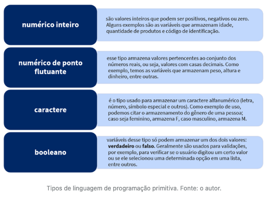
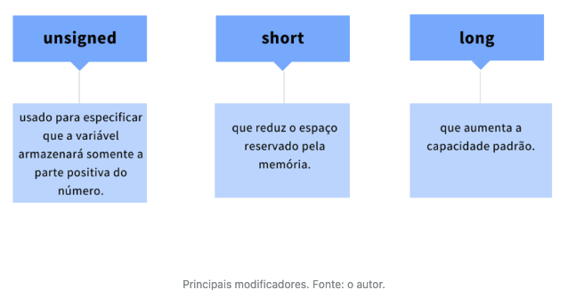
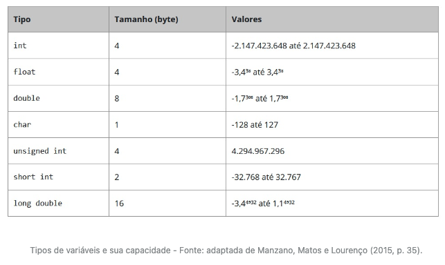
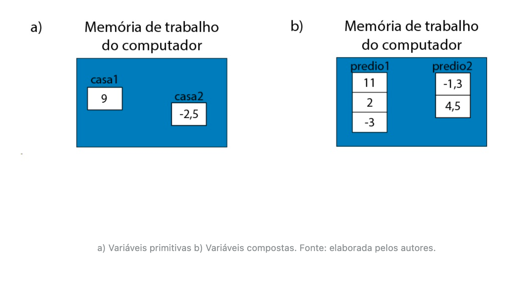
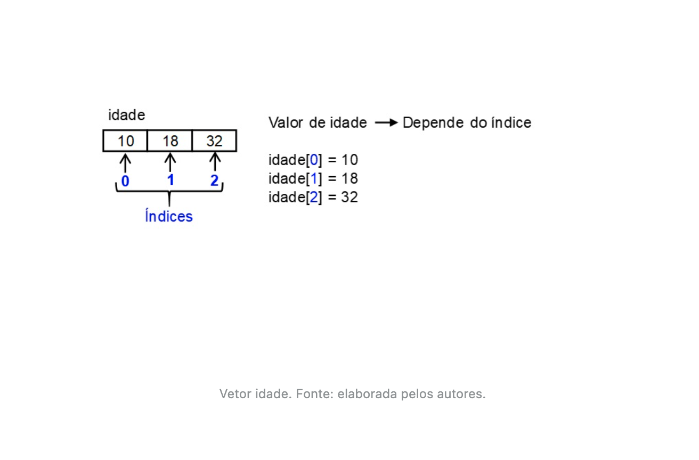
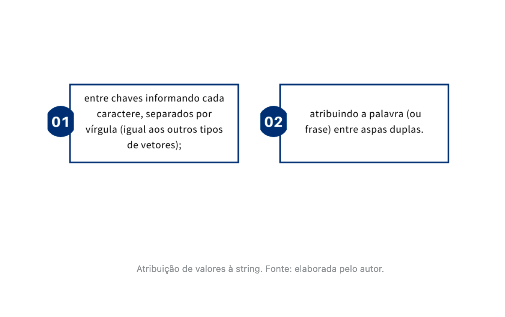
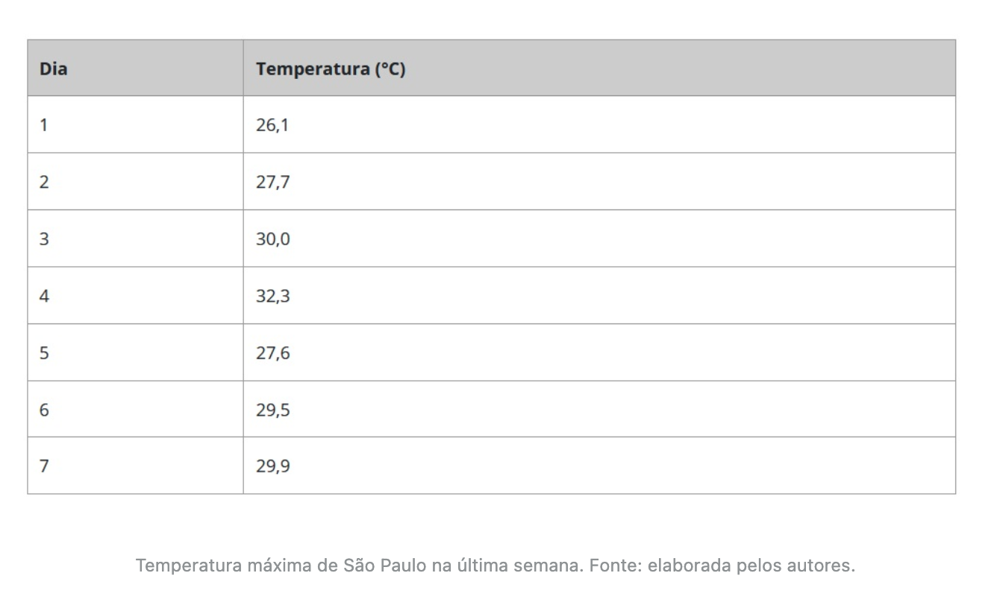
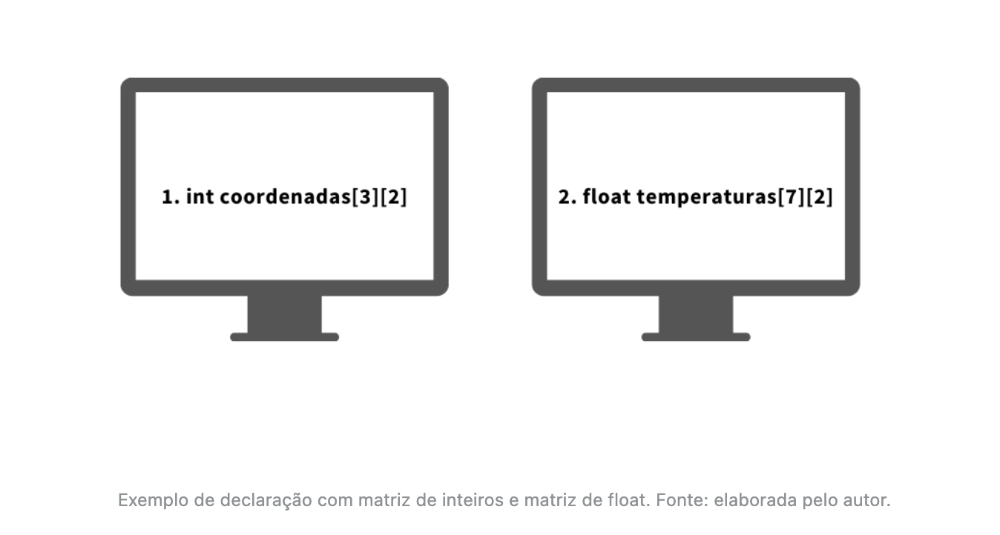
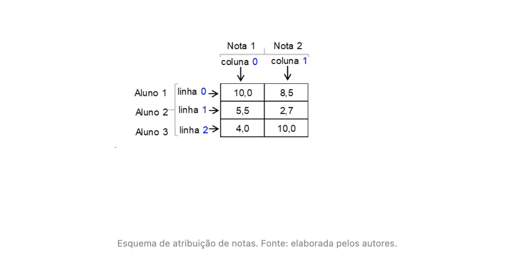

# Componentes e elementos de linguagem de programação


## Introdução da aula

- Nesta aula, você vai conhecer o conceito de variáveis e constantes, bem como seu uso na linguagem C.
- Até então, você já construiu um algoritmo capaz de receber como entradas a idade do cliente e a classificação indicativa do filme que ele pretende locar e, logo após, mostrar na tela um dos possíveis resultados: "Este filme não é indicado para sua faixa etária" ou "Este filme é indicado para sua faixa etária".
- Agora é hora de tirar essa ideia do papel e colocar para funcionar em um computador. Contudo, você ainda não dispõe de todos os conhecimentos necessários para implementar essa solução na linguagem C.
- Por isso, seu chefe lhe passou outra tarefa. Ele quer que seu programa seja capaz de ler a idade e o nome do cliente, bem como a classificação do filme que ele deseja locar. Posteriormente, seu programa deve imprimir todas essas informações na tela, conforme o padrão a seguir:

```
Cliente: José das Couves

Idade: 18 anos

Classificação do filme: 12 anos
```

- Seu chefe, que também é analista de sistemas, informou que você deve utilizar os conceitos de *struct*, variáveis e constantes para resolver esse problema.

---


## Variáveis

- Deitel e Deitel (2011, p. 43) nos trazem a seguinte definição:

  > uma variável é uma posição na memória onde um valor pode ser armazenado para ser utilizado por um programa.

- Soffner (2013, p. 33) incrementa dizendo que:

  > variáveis são endereços de memória de trabalho que guardam, temporariamente, um valor utilizado pelo programa.

- Todas as linguagens de programação têm **tipos primitivos** (ou básicos) e **compostos**. No grupo dos primitivos estão os seguintes tipos:



---


## Linguagem de programação C

- Para se usar uma variável na linguagem de programação C é preciso criá-la e, para isso, usa-se a seguinte sintaxe:

```
<tipo> <nome_da_variavel>
```

- Esse padrão é obrigatório e podemos usar os seguintes tipos primitivos: *`int`* (inteiro), *`float`* ou *`double`* (ponto flutuante) e *`char`* (caractere). O tipo booleano é representado pela palavra-chave *`bool`*, entretanto, para seu uso, é necessário incluir a biblioteca `<stdbool.h>`.
- Uma biblioteca é um conjunto de funções e tipos de dados que podem ser reutilizadas em nossos próprios programas.
- Veja no código a seguir a criação de algumas variáveis na linguagem C:

```C
#include <stdbool.h>
int main(){
  int idade;
  float salario = 1250.75;
  double porcentagem_desconto = 2.5;
  bool estaAprovado = false;
  char genero = 'M';
  return 0;
}
```

- É importante ressaltar que todo programa em C deve conter uma função específica, denominada "*main*". Ela representa o ponto inicial do seu programa, ou seja, o ponto a partir do qual o computador começará a executá-lo.
- É uma boa prática de programação sempre inicializar as variáveis com algum valor específico, evitando que recebam dados de processamentos anteriores e que estejam na memória (a esses dados nós damos o nome de lixo de memória).
- Portanto, quando a variável for numérica, sempre vamos iniciar com zero; quando booleana, com falso; quando do tipo caractere, usaremos ' ' para atribuir vazio.

---


## Tipos de variáveis, sua capacidade e especificador de formato

- Como já mencionado, a quantidade de espaço que será alocada para uma variável depende do tipo de variável. Por exemplo, para uma variável int serão alocados 4 bytes na memória (MANZANO; MATOS; LOURENÇO, 2010).
- Vejamos, 4 bytes são 32 bits. Cada bit só pode armazenar zero ou um. Portanto, nós temos a seguinte equação: valor máximo de uma variável inteira = 2³²=4.294.967.296. Porém, esse valor precisa ser dividido por dois, pois um inteiro pode armazenar números negativos e positivos. Logo, uma variável int poderá ter um valor entre -2.147.423.648 e 2.147.423.648.
- Para suprir parte da limitação dos valores que uma variável pode assumir pelo seu tipo, foram criados modificadores de tipos, os quais são palavras-chave usadas na declaração da variável que modifica sua capacidade-padrão. Os três principais modificadores são:





- Vamos utilizar a ferramenta Paiza.io para testar as declarações das variáveis e a impressão de cada uma delas.
- Nota: estou usando o [replit.com](replit.com)

```c
#include <stdio.h>

int main() {
  int idade = 18;
  float salario = 1250.75;
  double porcentagem_desconto = 2.5;
  char genero = 'F';
  float altura = 1.63;

  printf("\n Idade: %d", idade);
  printf("\n Salário: %f", salario);
  printf("\n Desconto (%): %f", porcentagem_desconto);
  printf("\n Gênero: %c", genero);
  printf("\n Altura: %.3f", altura);
  printf("\n");
  return 0;
}
```

- ***<u>Output:</u>***

```
 Idade: 18
 Salário: 1250.750000
 Desconto (%): 2.500000
 Gênero: F
 Altura: 1.630
```


---


## O endereço de memória de uma variável e constantes

- A memória de um computador é dividida em blocos de bytes (1 byte é um conjunto de 8 bits) e cada bloco tem um endereço que o identifica. Podemos fazer uma analogia com os endereços das casas, já que cada casa detém uma localização, e se existissem dois endereços iguais, certamente seria um grande problema.

- Será que conseguimos saber o endereço de alocação de uma variável? A resposta é sim. Para sabermos o endereço de uma variável basta utilizarmos o **operador &** na hora de imprimir a variável.

- Para armazenar valores digitados pelo usuário em uma variável, podemos usar a função scanf(), com a seguinte estrutura:

  ```c
  scanf("especificador",&variavel);
  ```

- Exemplo de código que armazena duas variáveis informadas:

```c
#include <stdio.h>

int main() {
  float valor1 = 0, valor2 = 0;

  printf("\n Digite o primeiro valor..: ");
  scanf("%f", &valor1);
  printf("\n Digite o segundo valor...: ");
  scanf("%f", &valor2);
  printf("\n Variável 1 = %.2f", valor1);
  printf("\n Variável 2 = %.2f\n", valor2);
  return 0;
}
```

- ***<u>Output:</u>***

```
 Digite o primeiro valor..: 2.3

 Digite o segundo valor...: 5

 Variável 1 = 2.30
 Variável 2 = 5.00
```

- Para impressão do endereço da variável é necessário utilizar o operador `&` junto do especificador de formato `"%p"`:

```c
#include <stdio.h>

int main(void) {
  // declare variables
  int a;
  float b;
  char c;

  printf("Address of a: %p\n", &a);
  printf("Address of b: %p\n", &b);
  printf("Address of c: %p\n", &c);

  return 0;
}
```

- ***<u>Output:</u>***

```
Address of a: 0x7ffee069702c
Address of b: 0x7ffee0697028
Address of c: 0x7ffee0697027
```

- Impressão de variáveis recebidas

```c
#include <stdio.h>

int main() {
  float valor1 = 0, valor2 = 0;

  printf("\n Digite o primeiro valor: ");
  scanf("%f", &valor1);
  printf("\n Digite o segundo valor: ");
  scanf("%f", &valor2);
  printf("\n Variavel 1 = %.2f", valor1);
  printf("\n Variavel 2 = %.2f\n", valor2);
}
```

- ***<u>Output:</u>***

```
 Digite o primeiro valor: 1.2

 Digite o segundo valor: 3.9

 Variavel 1 = 1.20
 Variavel 2 = 3.90
```

- Declara-se uma constante utilizando a diretiva `#define`, logo após a inclusão das bibliotecas. Ex:

```c
#define <nome_da_constante> <valor>
```

- Não é utilizado ponto e vírgula e uma constante não armazena espaço na memória, é criado um rótulo que irá substituir as outras ocorrências.

- A outra forma de se criar valores constantes é similar à criação de variáveis, porém, antes do tipo, usa-se a palavra-chave const. Portanto, a sintaxe ficará como segue:

  ```c
  const <tipo> <nome_da_constante>;
  ```

- Dessa forma, quando declara a constante ela utilizará espaço na memória, de acordo com cada tipo de dado.

```c
#include <stdio.h>

#define PI 3.14

int main() {
  const float G = 9.80;

  printf("\n PI = %f", PI);
  printf("\n G  = %f\n", G);

  return 0;
}
```

- ***<u>Output:</u>***

```
 PI = 3.140000
 G  = 9.800000
```

---


## Variáveis compostas

- A melhor solução para armazenar diversos valores dentro de um mesmo contexto é utilizar variáveis compostas. Esse recurso permite armazenar diversos valores utilizando um mesmo nome de variável (MANZANO; MATOS; LOURENÇO, 2015).
- Quando alocamos uma variável composta do tipo int, **um conjunto de blocos** de 4 bytes será reservado. O tamanho desse conjunto (1, 2, 3 ...*N* blocos) é especificado pelo programador.
- Se, nas variáveis compostas, em um mesmo nome de variável, por exemplo predio1 (veja o exemplo anterior), são guardados muitos valores, como diferenciar um valor do outro? Assim como os apartamentos em um prédio têm números para diferenciá-los, as variáveis compostas têm **índices** que as diferenciam.



- As variáveis compostas são formadas a partir dos tipos primitivos e podem ser classificadas em homogêneas (mesmo tipo primitivo) e heterogêneas (diferentes tipos). Além disso, podem ser unidimensionais ou multidimensionais, e a bidimensional é mais comumente usada (MANZANO; MATOS; LOURENÇO, 2015).

---


# Variáveis compostas homogêneas unidimensionais (vetores)

- São unidimensionais, e isso quer dizer que elas apresentam a estrutura de uma tabela contendo apenas 1 coluna e N linhas (o resultado não se altera se pensarmos em uma estrutura como uma tabela de 1 linha e N colunas). Esse tipo de estrutura de dados é chamado de **vetor** ou **matriz** unidimensional (MANZANO; MATOS; LOURENÇO, 2015).
- A criação de um vetor é similar a uma variável primitiva, tendo que acrescentar apenas um número entre colchetes indicando qual será o tamanho desse vetor (quantidade de blocos). Portanto, a sintaxe ficará da seguinte forma:

```c
<tipo> <nome_do_vetor>[tamanho];
```

- Vamos criar um vetor em C para armazenar a altura (em metros) de 3 pessoas. Veja no código – Inicializando um vetor utilizando operador chaves ({ }), que, na linha 3, foi criado o vetor *altura*, que foi inicializado com valores. Para armazenar valores no vetor no momento da criação, colocamos os elementos entre chaves ({ }) separados por vírgula. Da linha 4 a 6 é feita a impressão dos valores guardados no vetor *altura*.

```c
#include <stdio.h>

int main() {
  float altura[3] = {1, 1.5, 1.7};

  printf("\n Exemplo 1:\n");
  printf("\n Vetor altura[0] = %f", altura[0]);
  printf("\n Vetor altura[1] = %f", altura[1]);
  printf("\n Vetor altura[2] = %f\n", altura[2]);

  return 0;
}
```

* ***<u>Output:</u>***

```
 Exemplo 1:

 Vetor altura[0] = 1.000000
 Vetor altura[1] = 1.500000
 Vetor altura[2] = 1.700000
```

* Também é possível declarar o vetor e seus valores conforme a forma abaixo:

```c
#include <stdio.h>

int main() {
  float altura[3];
  altura[0] = 1.50;
  altura[1] = 1.80;
  altura[2] = 2.02;

  printf("\n Exemplo 2:\n");
  printf("\n Vetor altura[0] = %f", altura[0]);
  printf("\n Vetor altura[1] = %f", altura[1]);
  printf("\n Vetor altura[2] = %f\n", altura[2]);

  return 0;
}
```

- ***<u>Output:</u>***

```
 Exemplo 2:

 Vetor altura[0] = 1.500000
 Vetor altura[1] = 1.800000
 Vetor altura[2] = 2.020000
```

- Para ajudar a compreensão, observe a figura a seguir, que representa um esquema para um vetor denominado *idade* na memória do computador. O valor do vetor depende da posição, ou seja, do índice.



- Para guardar um valor digitado pelo usuário em um vetor, usamos a função scanf(), porém, na variável, deverá ser especificado em qual posição do vetor se deseja guardar. Então, se quiséssemos guardar uma idade digitada pelo usuário na primeira posição do vetor, faríamos da seguinte forma:

```c
printf("Digite uma idade: ");

scanf("%d",&idade[0]);
```

- Exemplo de leitura de vetor:

```c
#include <stdio.h>

int main(void) {
  int idade[3] = {0, 0, 0};
  float media = 0.0;

  printf("\n Informe a idade da pessoa 1: ");
  scanf("%d", &idade[0]);
  printf("\n Informe a idade da pessoa 2: ");
  scanf("%d", &idade[1]);
  printf("\n Informe a idade da pessoa 3: ");
  scanf("%d", &idade[2]);
  media = (idade[0] + idade[1] + idade[2]) / 3;
  printf("\n Média de idade = %.2f\n", media);

  return 0;
}
```

- ***<u>Output:</u>***

```
 Informe a idade da pessoa 1: 40

 Informe a idade da pessoa 2: 33

 Informe a idade da pessoa 3: 2

 Média de idade = 25.00
```

---


# Vetor de caracteres (string)

- Sabendo que uma palavra é uma cadeia de caracteres, podemos concluir que esta é, na verdade, um vetor de caracteres (MANZANO; MATOS; LOURENÇO, 2015).
- A declaração de uma *string* em C é feita da seguinte forma:

```c
char <nome_da_string>[tamanho];

// Exemplos:

char nome[16];
char sobrenome[31];
char frase[101];
```

- A atribuição de valores à *string* pode ser feita no momento da declaração de duas formas:



- Exemplos:

```c
char nome[16]={'J','o','a','o'};

char sobrenome[31] = "Alberto Gomes";
```

- Veja o código responsável por armazenar o nome digitado por um usuário:

```c
char nome[16];

printf("\n Digite um nome:");
scanf("%s", nome);
printf("\n Nome digitado: %s", nome);
```

- Não pode ser usado para palavras compostas visto que a função `scanf()` interrompe a atribuição quando encontra um espaço em branco.
- Para contornar essa limitação, uma opção é usar a função fgets(), que também faz parte do pacote padrão <stdio.h>. Essa função apresenta a seguinte sintaxe:

```c
fgets(destino,tamanho,fluxo);
```

- Exemplo

```c
char frase[101];

printf("\n Digite uma frase:");
fflush(stdin);
fgets(frase, 101, stdin);
printf("\n Frase digitada: %s", frase);
```

- Usamos a função `fflush(stdin)`. Apesar de não ser obrigatório, isso é uma boa prática, pois garante que a entrada padrão (stdin) seja limpa (sem informações de leituras anteriores) antes de armazenar.

---


# Variáveis compostas homogêneas bidimensionais (matrizes)

- Observe a tabela a seguir, que apresenta alguns dados fictícios sobre a temperatura da cidade de São Paulo em uma determinada semana. Essa tabela representa uma estrutura de dados matriciais com 7 linhas e 2 colunas. Para armazenarmos esses valores em um programa de computador, precisamos de uma variável composta bidimensional ou, como é mais comumente conhecida, uma matriz bidimensional.



- Para criarmos uma matriz em C usamos a seguinte sintaxe:

```c
<tipo_dado> <nome_da_matriz>[numero_linhas][numero_colunas];
```



- A criação e manipulação de matrizes bidimensionais exige a especificação de dois índices, portanto, a atribuição de valores deve ser feita da seguinte forma:

```c
matriz[M][N] = valor;
```

- **M** representa a linha que se pretende armazenar e **N**, a coluna. Assim como nos vetores, aqui os índices sempre iniciarão em zero.
- Vamos criar uma matriz em *C* para armazenar as notas do primeiro e segundo bimestre de três alunos. Veja, na linha 3 do código - Matriz em *C -*, que criamos uma matriz chamada notas, com 3 linhas e 2 colunas, o que significa que serão armazenados 6 valores (linhas x colunas).

```c
#include <stdio.h>

int main() {

  float notas[3][2];

  // aluno 1
  notas[0][0] = 10;
  notas[0][1] = 8.5;

  // aluno 2
  notas[1][0] = 5.5;
  notas[1][1] = 2.7;

  // aluno 3
  notas[2][0] = 4;
  notas[2][1] = 10;
  return 0;
}
```

- ***<u>Output:</u>***

```
sem output
```

- A figura a seguir ilustra a estrutura de dados que é criada na memória para o código do código - Matriz em C. Veja que as linhas foram usadas para representar os alunos e as colunas para as notas.



- Para armazenar valores digitados pelo usuário em uma matriz, usamos a função scanf(), indicando os dois índices para selecionar a posição que se deseja guardar. Para impressão de valores, também devemos selecionar a posição por meio dos dois índices. Exemplo:

```c
float notas[3][2];

printf("Digite uma nota: ");

scanf("%f", as[1][0]);

printf("Nota digitada: %.2f", notas[1][0]);
```

- Nesse exemplo, a nota digitada será guardada na linha 1, coluna 0, e será exibida na tela usando duas casas decimais.

---


## Variáveis compostas heterogêneas (structs)

- Além das estruturas homogêneas, a linguagem de programação C oferece variáveis compostas heterogêneas chamadas de **estruturas** (*structs*) ou, ainda, de registros por alguns autores (SOFFNER, 2013).
- Na linguagem C, a criação de uma estrutura deve ser feita antes da função main() e deve apresentar a seguinte sintaxe:

```c
struct <nome>{
// nome e o nome atribuido a estrutura

  <tipo> <nome_da_variavel1>;
  <tipo> <nome_da_variavel2>;
  // …

};
```

- Vamos criar uma estrutura para armazenar o modelo, o ano e o valor de um automóvel. No código - *Struct* em C, “*Struct* em C”, a estrutura automóvel foi criada entre as linhas 3 e 7. Mas, para utilizar essa estrutura, na linha 10 foi criada a variável dadosAutomovel1, que é do tipo *struct* automovel.

```c
#include <stdio.h>

struct automovel {
  char modelo[20];
  int ano;
  float valor;
};

int main() {
  struct automovel dadosAutomovel1;
  printf("\n Digite o modelo do automovel: ");
  scanf("%s", dadosAutomovel1.modelo);
  printf("\n Digite o ano do automovel: ");
  scanf("%d", &dadosAutomovel1.ano);
  printf("\n Digite o valor do automovel: ");
  scanf("%f", &dadosAutomovel1.valor);

  printf("\n Dados atribuidos");
  printf("\n %s", dadosAutomovel1.modelo);
  printf("\n %d", dadosAutomovel1.ano);
  printf("\n %f\n", dadosAutomovel1.valor);
}
```

- ***<u>Output:</u>***

```
 Digite o modelo do automovel: Ferrari

 Digite o ano do automovel: 2022

 Digite o valor do automovel: 1000000

 Dados atribuidos
 Ferrari
 2022
 1000000.000000
```

---


## Variável do tipo ponteiro

- São os chamados **ponteiros**, por meio dos quais podemos manipular outras variáveis e outros recursos por meio do acesso ao endereço de memória (SOFFNER, 2013).
- Variáveis do tipo ponteiro são usadas exclusivamente para armazenar endereços de memória. O acesso à memória é feito usando dois operadores: o asterisco (*), utilizado para declaração do ponteiro, e o “&” é usado para acessar o endereço da memória, por isso é chamado de **operador de referência**. A sintaxe para criar um ponteiro tem como padrão:

```c
<tipo> *<nome_do_ponteiro>;

// Exemplo:
int *idade;
```

- Nesse exemplo, é criado um ponteiro do tipo inteiro, e isso significa que ele deverá “apontar” para o endereço de uma variável desse tipo. A criação de um ponteiro só faz sentido se for associada a algum endereço de memória. Para isso, usa-se a seguinte sintaxe:

```c
int ano = 2018;
int *ponteiro_para_ano = &ano;
```

- A figura - Ponteiro e variavel primitiva na memória -, ilustra, de forma simplificada, o esquema de uma variável com um ponteiro na memória. O conteúdo do ponteiro é o endereço da variável a que ele aponta e que ele também ocupa espaço na memória.


- Podemos imprimir o conteúdo do ponteiro, que será o endereço da variável a que ele aponta. Utilizando o ponteiro criado anteriormente (ponteiro_para_ano), temos a seguinte sintaxe:

```c
printf("\n Conteúdo do ponteiro: %p", ponteiro_para_ano);
// ou
printf("\n Conteúdo da variável pelo ponteiro: %d", *ponteiro_para_ano);
```

- Podemos, também, imprimir o endereço do próprio ponteiro, por meio da seguinte sintaxe:

```c
printf("\n Endereco do ponteiro: %p", &ponteiro_para_ano);
```

- O nome de um vetor nada mais é do que um ponteiro para o endereço de memória do seu primeiro elemento.

```c
#include <stdio.h>

int main() {
  int num[2] = {10, 20};

  printf("\n Utilizando índice do vetor: %d", num[0]);
  printf("\n Utilizando ponteiro: %d\n", *num);

  return 0;
}
```

- ***<u>Output:</u>***

```
 Utilizando índice do vetor: 10
 Utilizando ponteiro: 10
```

- Link para essa solução no replit.com [aqui](Link para essa solução no replit.com [aqui](https://replit.com/@vjunior1981/ampli-devops-criacao-de-constantes?v=1).

- Então fica fácil saber qual o endereço de memória do índice *X*.

  *Endereço de memória do índice X = endereço inicial + (tamanho do bloco de memória de um elemento \*X)*

- Assim, supondo que o endereço de memória inicial do vetor num seja 1080, que um inteiro ocupe 4 bytes de memória, então a posição de memória do elemento da posição 1 do vetor é dada por:

  *Endereço do num[1] = 1080 + (4 \*1) = 1084*

---


## Vídeoaula: Exercício algoritmos

- Verdadeiro ou Falso?

```
(F) O printf é um comando de entrada de dados; ### Acertei
(V) O float representa o tipo de dado decimal em C; ### Acertei
(F) Palavras reservadas são os nomes que damos as variáveis; ### Acertei
```

---


## Conclusão

- Para ampliar sua visão acerca das possibilidades de aplicação dos conhecimentos obtidos até o momento, vamos resolver a situação-problema proposta anteriormente: é hora de estruturar a solução para a nova funcionalidade do software da empresa.
- Para tal, inicialmente precisamos declarar as variáveis de entrada do problema em questão. Como nome e idade do cliente pertencem a uma mesma entidade – a saber, um cliente –, podemos trabalhar com o conceito de structs.
- Podemos usar, também, o conceito de constante para armazenar o tamanho da string que armazenará o nome do cliente. Para armazenar a classificação do filme, basta uma variável primitiva do tipo inteiro.
- Quanto ao processo de leitura e impressão dos valores dessas variáveis, deve-se estar atento ao uso do operador ponto (.) para acessar campos de um *struct*. Também é importante lembrar-se do uso das funções `fflush()` e `fgets()` para leitura de *strings*.

```c
#include <stdio.h>

#define TAM_NOME_CLIENTE 100

struct cliente {
  char nome[TAM_NOME_CLIENTE];
  int idade;
};

int main(void) {
  struct cliente cli;
  int classificacao_filme;

  printf("\n Informe o nome do cliente: ");
  fflush(stdin);
  fgets(cli.nome, TAM_NOME_CLIENTE, stdin);

  printf("\n Informe a idade do cliente: ");
  scanf("%d", &cli.idade);

  printf("\n Informe a classificação do filme: ");
  scanf("%d", &classificacao_filme);

  printf("\n Cliente: %s", cli.nome);
  printf("\n Idade: %d anos\n", cli.idade);
  printf("\n Classificação do filme: %d anos\n", classificacao_filme);
}
```

- ***<u>Output:</u>***

```
 Informe o nome do cliente: Vitor

 Informe a idade do cliente: 40

 Informe a classificação do filme: 21

 Cliente: Vitor

 Idade: 40 anos

 Classificação do filme: 21 anos
```

