# Operações e expressões


## Introdução da aula

- Nesta aula, você verá nesta aula como utilizar os operadores aritméticos, relacionais e lógicos, além de conhecer algumas funções predefinidas.
- A fim de colocarmos em prática os conhecimentos a serem aprendidos, vamos analisar a seguinte situação-problema: Seu chefe está muito contente, pois ele sabe que agora você será capaz de resolver problemas mais desafiadores na empresa. Sua última atividade foi escrever um programa na linguagem *C* que fosse capaz de ler a idade e o nome do cliente, bem como a classificação do filme que ele deseja locar. Posteriormente, seu programa deveria imprimir todas essas informações na tela, conforme o padrão a seguir:

```
Cliente: José das Couves

Idade: 18 anos

Classificação do filme: 12 anos
```

- Agora, seu chefe pediu para você melhorar esse programa, de forma que ele seja capaz de mostrar ao cliente:
  1. se o filme desejado está disponível ou não.
  2. se o filme desejado pode ser locado pelo cliente, levando em consideração se o filme está disponível e se ele é indicado para sua faixa etária.
  3. quantos anos faltam para que a classificação do filme seja adequada à faixa etária do cliente.

---


## Operadores aritiméticos na linguagem C

- Vamos começar a aprimorar nossos algoritmos com as operações aritméticas. Observe o quadro - Operações aritméticas básicas em linguagens de programação -, que demonstra algumas operações disponíveis na linguagem *C* e seus respectivos exemplos.

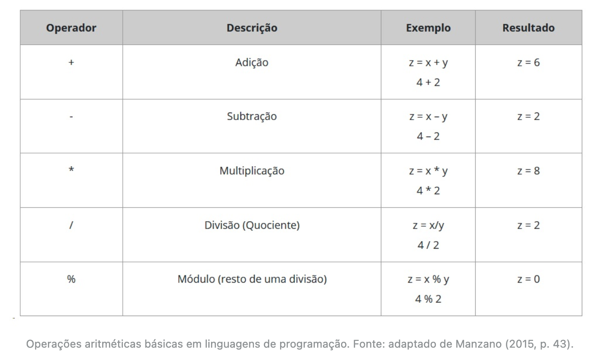

- Vamos criar um programa em *C* que some a idade de duas pessoas e imprima na tela o resultado. No código – Soma da idade de duas pessoas –, está o código que realiza tal processo.

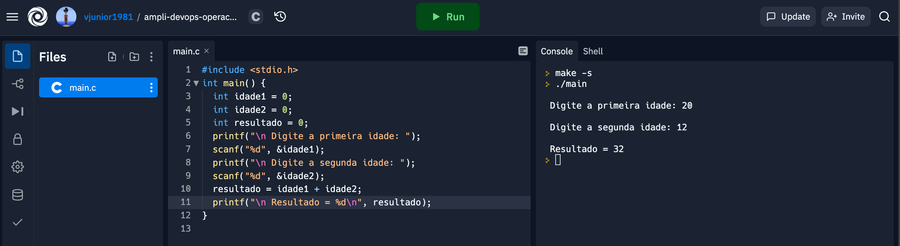

- Link para essa solução no replit.com [aqui](https://replit.com/@vjunior1981/ampli-devops-operacoes-expressoes?v=1).
- Quando trabalhamos com operadores, a **ordem de precedência** é muito importante. Segundo Soffner (2013), os operadores aritméticos apresentam a seguinte ordem de execução:

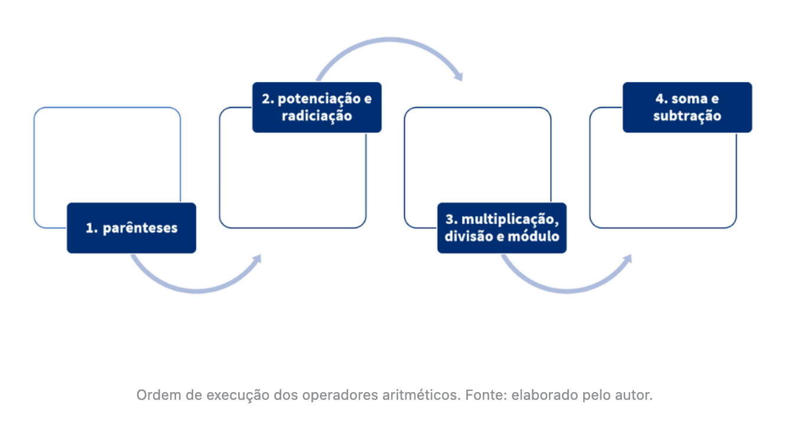

- Das operações aritméticas apresentadas no quadro – Operações aritméticas básicas em linguagens de programação –, a operação módulo (%) talvez seja a que você ainda não tenha familiaridade. Essa operação faz a divisão de um número considerando somente a parte inteira do quociente e retorna o resto da divisão. Como exemplo, vamos aplicar o operador módulo para efetuar o processamento de 43 % 3.

```c
#include <stdio.h>

int main() {
  int resultado = 43 % 3;
  printf("Operacao modulo 43 % 3 = %d\n", resultado);
}
```

- Veja na figura – Operação aritmética módulo –, o cálculo matemático que é efetuado e como o resultado é obtido, você terá o resultado correto? Se for um cálculo para o setor financeiro de uma empresa, seu cálculo mostraria lucro ou prejuízo?

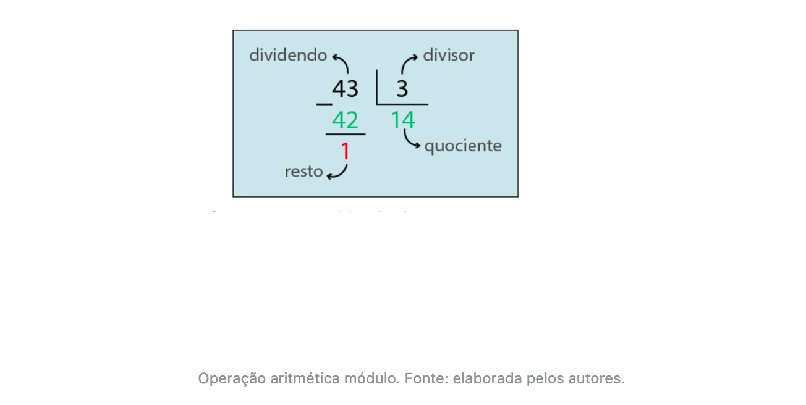

- O quadro a seguir apresenta um resumo dos operadores unários.

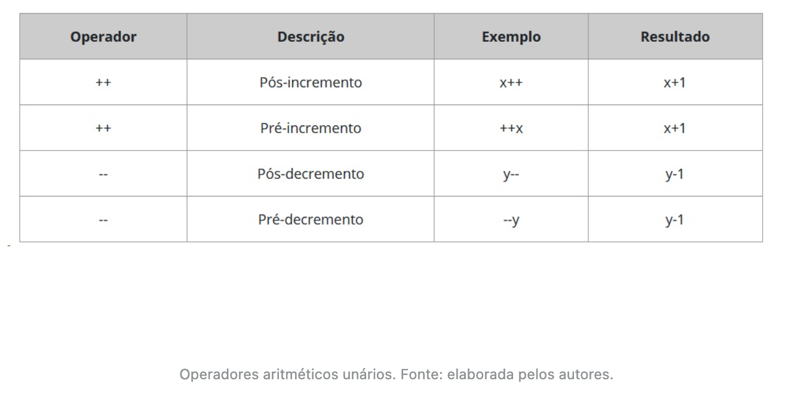

- Esses operadores acrescentam ou diminuem “um” ao valor de uma variável e podem ser usados de duas formas:

  - **Após a variável:**

    - pós-incremento: *x*++; nesse caso, é adicionado 1 (um) após a primeira execução.

    - pós-decremento: *x*- -; nesse caso, é decrementado 1 (um) após a primeira execução.

  - **Antes da variável:**

    - pré-incremento ++*x*; nesse caso, é adicionado 1 (um) antes da primeira execução.

    - pré-decremento --*x*; nesse caso, é decrementado 1 (um) antes da primeira execução.

- Exemplo de código com implemento pré e pós variável. Repare nas linhas "Resultado" o valor do output:


- Link para essa solução no replit.com [aqui](https://replit.com/@vjunior1981/ampli-devops-operadores-unarios?v=1).

---


## Operadores relacionais na linguagem C

- Em programação, para compararmos valores, usamos operadores relacionais. O quadro - Operadores relacionais em linguagens de programação -, apresenta os operadores usados na linguagem de programação *C* (DEITEL; DEITEL, 2011).

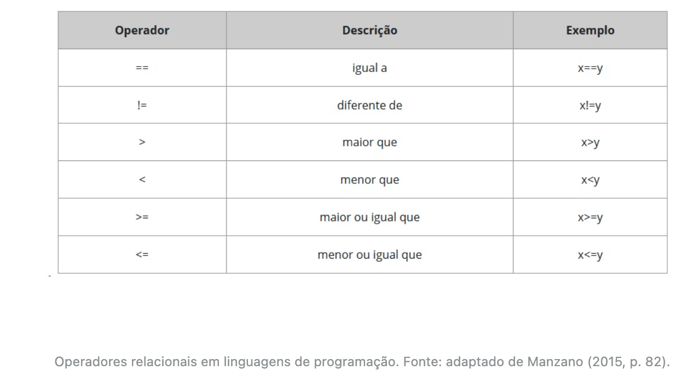

- Os operadores relacionais são usados para construir expressões booleanas, ou seja, expressões que terão como resultado verdadeiro (valor 1) ou falso (valor 0).
- Vamos criar um programa que solicita ao usuário dois números inteiros e faz algumas comparações com esses valores. Veja, no código - Comparações entre dois números -, que na linha 9 comparamos se os números são iguais; na linha 10, se o primeiro (n1) é maior que o segundo (n2) e, na linha 11, se o primeiro é menor ou igual ao segundo.

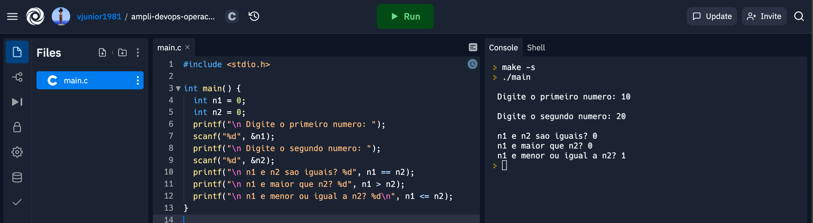

- Link para essa solução no replit.com [aqui](https://replit.com/@vjunior1981/ampli-devops-operacoes-relacionais?v=1).

---


## Operadores lógicos na linguagem C

- O quadro a seguir apresenta os operadores lógicos que podem ser usados na linguagem *C*.

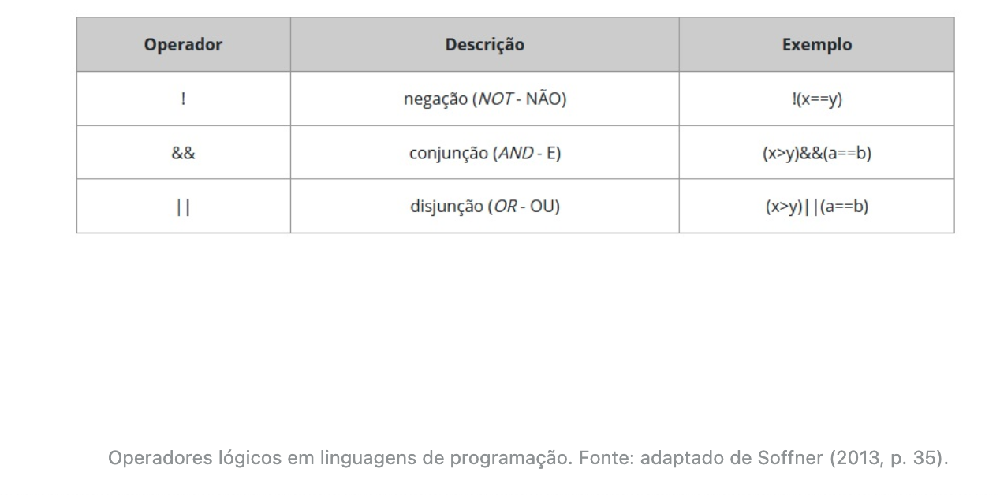

- Veja, no código – Operadores relacionais e lógicos –, o uso dos operadores relacionais e lógicos aplicados à comparação dos valores de três variáveis.


- Link para essa solução no replit.com [aqui](https://replit.com/@vjunior1981/ampli-devops-operacoes-logicos?v=1).

---


## Funções predefinidas para a linguagem C

- Entende-se por função: um conjunto de instruções que efetuam uma tarefa específica (MANZANO, 2015, p. 153).
- Existe uma série de bibliotecas e funções disponíveis na linguagem *C* que podem facilitar o desenvolvimento de soluções. Em **C Standard Library Reference Tutorial**, você encontra uma vasta referência a esses elementos.
- Vamos apresentar algumas funções que costumam aparecer com frequência nos programas implementados na linguagem *C* (quadro - Algumas bibliotecas e funções na linguagem C).

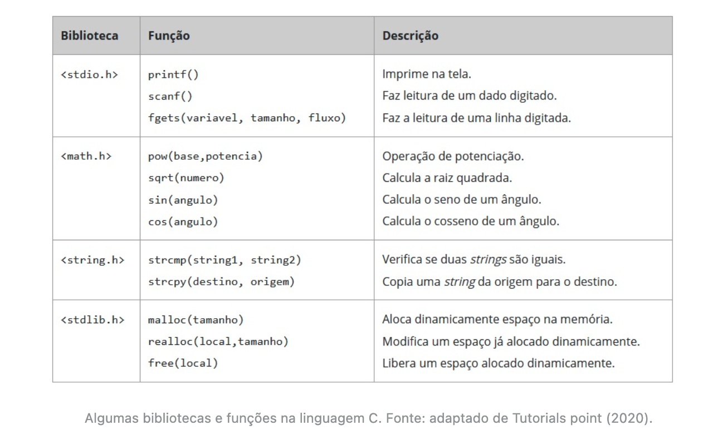

- A função *strcmp*(*string*1, *string*2) compara o conteúdo de duas *strings* e pode retornar três resultados, o valor nulo (zero), positivo ou negativo, conforme as seguintes regras:
  - quando as *strings* forem iguais, a função retorna 0.
  - quando as *strings* forem diferentes e o primeiro caractere não coincidir entre elas, sendo “maior” na primeira, a função retorna um valor positivo. Entende-se por “maior” o caractere com maior código ASCII, que é atribuído em ordem alfabética, ou seja, o caractere b é maior que a.
  - quando as *strings* forem diferentes e a primeira apresentar o caractere, não coincidente e “menor” que a segunda, então o valor resultante é negativo. Por exemplo, o caractere d é menor que h.
  - caso o primeiro caractere de ambas as *strings* seja igual, as duas regras anteriores são aplicadas para o próximo caractere, e assim sucessivamente.
- Observe o uso da função *strcmp* no código a seguir.

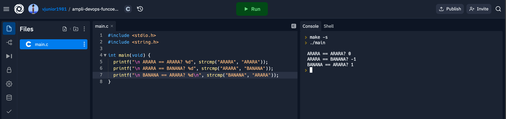

- Link para essa solução no replit.com [aqui](https://replit.com/@vjunior1981/ampli-devops-funcoes-predefinidas?v=1).

---


## Conclusão

- Para ampliar sua visão acerca das possibilidades de aplicação dos conhecimentos obtidos até o momento, vamos retomar a situação-problema: Seu chefe solicitou que você aprimore um programa que vem sendo desenvolvido na empresa onde trabalha. Vamos então recordar o que já sabemos?

```c
#include <stdio.h>

#define TAM_NOME_CLIENTE 100

struct cliente {
  char nome[TAM_NOME_CLIENTE];
  int idade;
};

int main(void) {
  struct cliente cli;
  int classificacao_filme;

  printf("\n Informe o nome do cliente: ");
  fflush(stdin);
  fgets(cli.nome, TAM_NOME_CLIENTE, stdin);

  printf("\n Informe a idade do cliente: ");
  scanf("%d", &cli.idade);

  printf("\n Informe a classificação do filme: ");
  scanf("%d", &classificacao_filme);

  printf("\n Cliente: %s", cli.nome);
  printf("\n Idade: %d anos\n", cli.idade);
  printf("\n Classificação do filme: %d anos\n", classificacao_filme);
}

```

- Link para essa solução no replit.com [aqui](https://replit.com/@vjunior1981/ampli-devops-conclusao-cliente?v=1).

- Uma das novas funcionalidades propostas por seu chefe é que o programa informe ao cliente se o filme desejado está disponível para ser locado ou não. Nós já temos uma informação a respeito do filme, que é sua classificação. Então, para que nosso código fique organizado, vamos criar uma *struct* denominada Filme, assim como fizemos com o cliente.

```c
struct filme {
  int classificacao_filme;
  int esta_disponivel;
};
```

- Você também precisa de um trecho de código capaz de ler a informação se o filme está disponível ou não do teclado e imprimi-la na tela. Com os conhecimentos aprendidos, você consegue realizar essa etapa.
- A próxima melhoria a ser feita no programa é informar se o filme desejado pode ser locado pelo cliente, levando em consideração se o filme está disponível e se é indicado para a sua faixa etária.
- Nós já temos as informações necessárias para efetuar esse processamento. Então, vamos criar uma expressão lógica que resultará em 0 (falso) ou 1 (verdadeiro), dependendo dos valores das variáveis de entrada.
- Para que o resultado seja 1 (verdadeiro), a idade do cliente deve ser maior ou igual à classificação do filme **e** o filme deve estar disponível. Com base na versão atual do código do programa, a expressão lógica a ser utilizada é:

```c
(fi.esta_disponivel) && (cli.idade >= fi.classificacao_filme))
```

- Por fim, o programa deve informar quantos anos faltam para que a classificação do filme seja adequada à faixa etária do cliente. Nesse caso, precisamos pensar um pouco mais para resolver esse problema com os recursos que aprendemos até o momento.
- Você se lembra de que o resultado de uma expressão lógica é 0 ou 1. Então, se pensarmos na expressão (cli.idade < fi.classificacao_filme), seu resultado será 0 quando a idade do cliente for maior ou igual à classificação do filme ou 1, quando a idade do cliente for menor do que a classificação do filme.

```c
(cli.idade < fi.classificacao_filme) * (fi.classificacao_filme - cli.idade))
```

- O resultado dessa expressão será um número inteiro, que responde à seguinte pergunta: “quantos anos faltam para que a classificação do filme seja adequada à faixa etária do cliente?”.

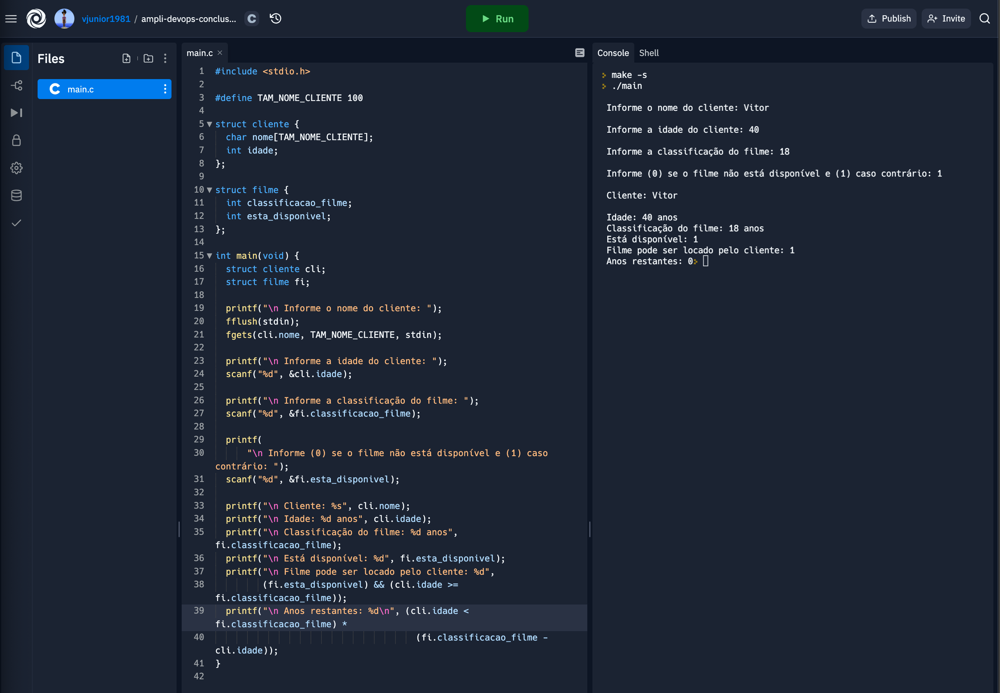

- Link para essa solução no replit.com [aqui](https://replit.com/@vjunior1981/ampli-devops-conclusao-cliente-1?v=1).

