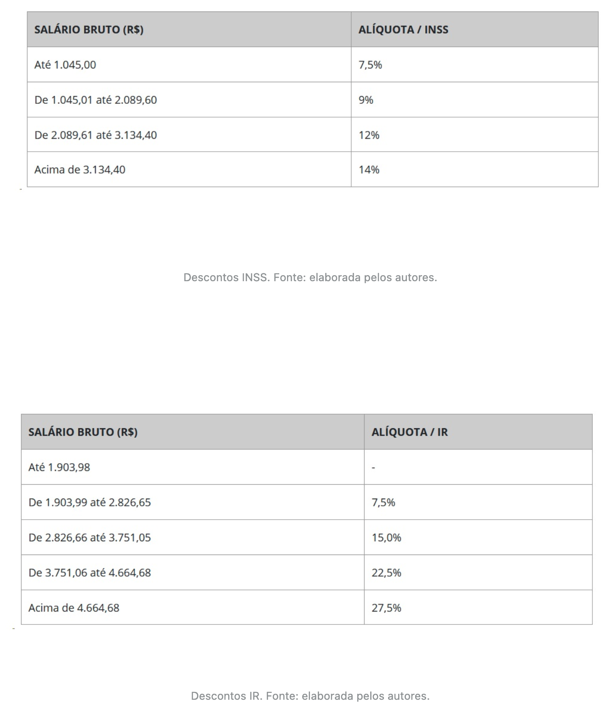
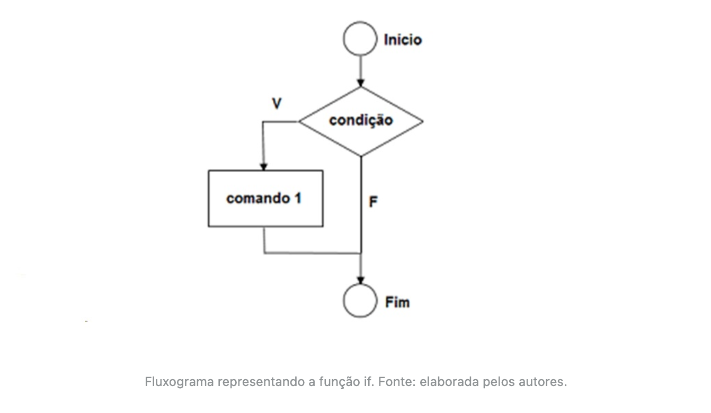
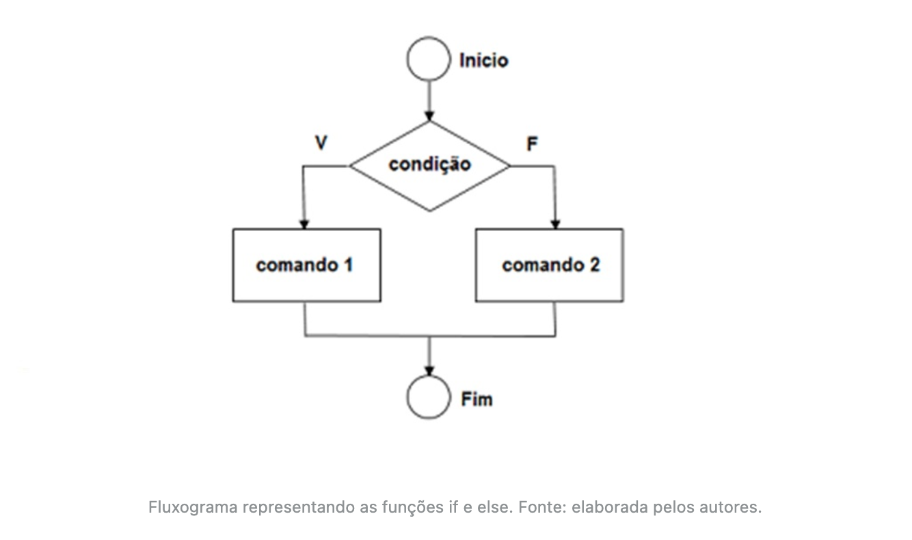
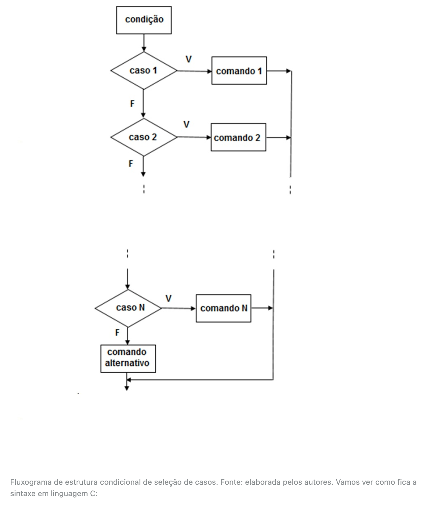
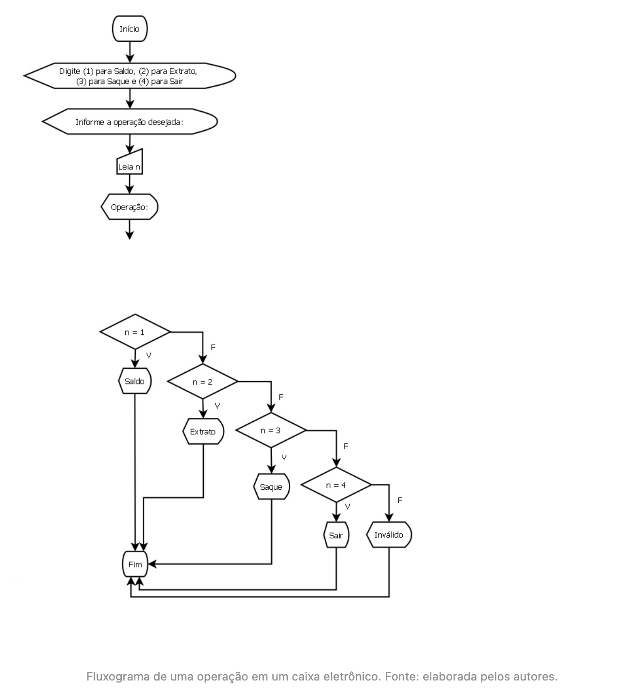
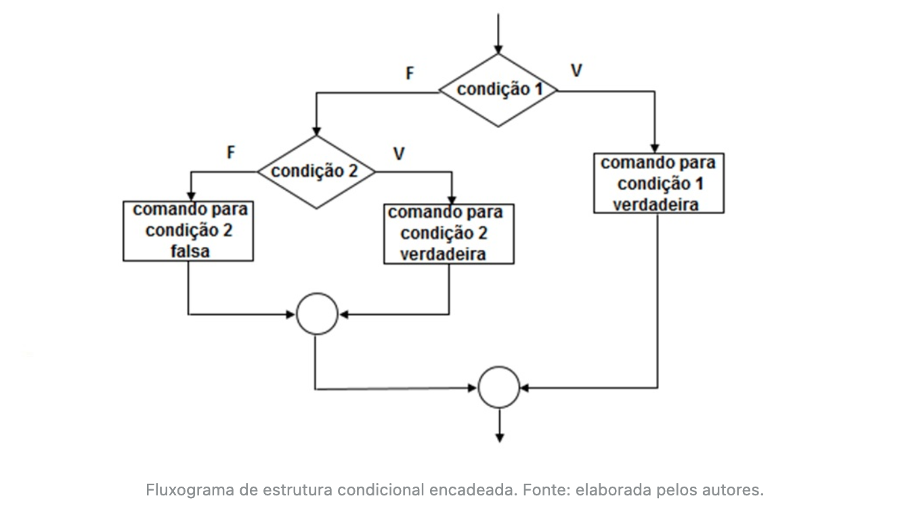

# Tomada de decisões


## Introdução da unidade

- Nesta unidade, a fim de colocarmos em prática os conhecimentos a serem aprendidos, consideraremos o seguinte contexto de aprendizagem: vamos tratar de uma famosa instituição de ensino, referência no mercado educacional, para a qual você presta serviço por meio da empresa de software onde trabalha.
- O próximo passo será começar a trabalhar com a linguagem de programação *C*, é certo que a programação condicionada passará a ser uma oportunidade de otimização e melhoramento das rotinas da instituição de ensino para a qual você e seu estagiário prestarão serviço.

---


## Introdução da aula

- A instituição de ensino está passando por um processo de otimização nas suas atividades e colocou o seguinte desafio para vocês: realizar um programa em linguagem *C* que calcule o valor do salário líquido, levando em consideração os descontos de INSS e Imposto de Renda (tabelas - Descontos INSS e tabela - Descontos IR).



---


## Estrutura de decisão condicional if/else

- Na linguagem de programação *C*, utilizamos chaves ("{" e "}") para determinar o início e o fim de um bloco de instruções. Já a condição deve estar entre parênteses “()”.
- Observe na figura a seguir como fica a estrutura condicional simples utilizando fluxograma e, na sequência, a sintaxe da instrução *if* utilizada na linguagem *C*.



- Agora, veja a representação da sintaxe:

```c
if <(condição)> {
  <conjunto de instruções>;
```

---


## Estrutura condicional simples e composta

- Veja no exemplo que segue a situação de um jovem que verifica se poderá ou não tirar a carteira de habilitação:

```c
#include <stdio.h>

int main() {
  int idade;
  printf("\n Digite sua idade: ");
  scanf("%d", &idade);
  if (idade >= 18) {
    printf("\n Você já pode tirar sua carteira de Habilitação, você tem 18 ou mais anos!\n");
  }
  return 0;
}
```

- ***<u>Output:</u>***

```
 Digite sua idade: 40

 Você já pode tirar sua carteira de Habilitação, você tem 18 ou mais anos!
```

- Agora, veremos a seguir, a **estrutura condicional composta**, que completa a nossa condição inicial com o comando else, que significa “se não”. Vejamos como fica a estrutura no fluxograma da figura - Fluxograma representando as funções *if* e *else*:



- Agora, veja a representação da sintaxe:

```c
if <(condição)> {
	<primeiro conjunto de instruções>;
	} else {
  <segundo conjunto de instruções>;
}
```

- Vamos, agora, criar outra situação para a estrutura condicional composta em linguagem *C*: Maria e João estão se preparando para uma viagem. Se o orçamento final deles for igual ou maior a R$ 10.000 eles farão uma viagem internacional; caso contrário, deverão fazer uma viagem nacional.

```c
#include <stdio.h>

int main() {
  float orcamento;
  printf("\n Digite o valor do orcamento para viagem \n");
  scanf("%f", &orcamento);
  if (orcamento >= 10000) {
    printf("\n João e Maria possuem orçamento para uma viagem internacional\n");
  } else {
    printf("\n João e Maria irão optar por uma viagem nacional\n");
  }
  return 0;
}
```

- ***<u>Output:</u>***

```
 Digite o valor do orcamento para viagem 
100000

 João e Maria possuem orçamento para uma viagem internacional
```

- Para reforçar o seu conhecimento, vamos ver o exemplo que segue em linguagem de programação *C*, que retorna se o valor de um número digitado é par ou ímpar, representando uma estrutura condicional composta. Além disso, aplicaremos o operador aritmético módulo (%).


```c
#include <stdio.h>

int main() {
  int num;
  printf("\n Digite um número inteiro:\n");
  scanf("%d", &num);
  if (num % 2 == 0) {
    printf("\n O número é par\n");
  } else {
    printf("\n O numero é ímpar\n");
  }
  return 0;
}
```

- ***<u>Output:</u>***

```
 Digite um número inteiro:
4

 O número é par
```

- Sabemos que todo número par é divisível por 2; isso significa que ao dividirmos esse número por 2, o resto será zero. Sabemos, ainda, que o operador módulo (%) nos devolve o resto da divisão inteira entre dois números.

---


## Estrutura condicional de seleção de casos

- Dando sequência aos estudos, vamos conhecer a **estrutura condicional de seleção de casos**, *switch-case* que, segundo Schildt (1997, p. 35):

  > testa sucessivamente o valor de uma expressão contra uma lista de constantes inteiras ou de caractere.

- Devemos estar atentos a algumas particularidades para o comando *switch-case*:

  - caso nenhum dos valores seja encontrado, o comando *default* será executado;
  - os comandos são executados até o ponto em que o comando *break* for localizado.

- Veja na figura a seguir o fluxograma representando a estrutura condicional de seleção de casos:



- Vamos ver como fica a sintaxe em linguagem C:

```c
case constante1:
     <comandos>
     break;
case constante2:
     <comandos>
     break;
default: <comandos>
}
```

- Veja que o comando *break* é utilizado para forçar a saída da estrutura condicional, ou seja, ele sai do comando sem executar as próximas instruções. Caso não seja colocado o comando *break*, o programa continua e averigua o próximo caso até o fim do *switch* ou até encontrar um *break*.
- A figura - Fluxograma de uma operação em um caixa eletrônico -, mostra um exemplo de operação em um caixa eletrônico utilizando fluxograma.



- Que tal colocar em prática o uso da estrutura condicional *switch-case* com esse exemplo? O código a seguir traduz o fluxograma anterior para a linguagem de programação *C*.

```c
#include <stdio.h>

int main(void){
    int n;
    
    printf("\n(1) para Saldo\n(2) para Extrato\n(3) para Saque\n(4) para Sair\n");
    printf("\nInforme a operação desejada: ");
    
    scanf("%d", &n);
    
    switch(n) {
        case 1: 
            printf("\nSaldo\n");
            break;
        case 2: 
            printf("\nExtrato\n");
            break;
        case 3: 
            printf("\nSaque\n");
            break;
        case 4: 
            printf("\nSair\n");
            break;
        default:
            printf("\nInválido\n");
    }
}
```

- ***<u>Output:</u>***

```
(1) para Saldo
(2) para Extrato
(3) para Saque
(4) para Sair

Informe a operação desejada: 1

Saldo
```

- Para fixar o que está sendo estudado, vamos aplicar, a seguir, um exemplo cuja finalidade é descobrir o desconto que um cliente terá, de acordo com a escolha de uma cor específica marcada em cada produto:


```c
#include <stdio.h>

int main() {
  char x;
  float valor, desc, total;
  printf("\nDigite o valor da compra: ");
  scanf("%f", &valor);
  printf(
      "\nDigite a letra que representa o seu desconto de acordo com a cor: ");
  printf("\na. azul");
  printf("\nv. vermelho");
  printf("\nb. branco");
  printf("\nDigite sua opção: ");
  scanf("%s", &x);
  switch (x) {
  case 'a':
    printf("\nVocê escolheu a cor azul, seu desconto será de 30 por cento!");
    desc = 30;
    break;
  case 'v':
    printf(
        "\nVocê escolheu a cor vermelha, seu desconto será de 20 por cento!");
    desc = 20;
    break;
  case 'b':
    printf("\nVocê escolheu a cor branca, seu desconto será de 10 por cento!");
    desc = 10;
    break;
  default:
    printf("\nOpcão inválida, não será concedido desconto!\n");
    desc = 0;
  }
  total = valor - (valor * desc / 100);
  printf("\nO valor da sua compra é R$ %.2f\n", total);

  return 0;
}
```

- ***<u>Output:</u>***

```
Digite o valor da compra: 100

Digite a letra que representa o seu desconto de acordo com a cor: 
a. azul
v. vermelho
b. branco
Digite sua opção: a

Você escolheu a cor azul, seu desconto será de 30 por cento!
O valor da sua compra é R$ 70.00
```

---


## Estrutura condicional encadeada

- Segundo Schildt (1997), essa estrutura é um comando *if* que é o objeto de outros *if* e *else*. Em resumo, um comando *else* sempre estará ligado ao comando *if* de seu nível de aninhamento.
- Veja na figura - Fluxograma de estrutura condicional encadeada -, um dos tipos de fluxogramas que representa uma estrutura condicional encadeada.



- Podemos caracterizar a sintaxe de uma estrutura condicional encadeada da seguinte forma:

```c
if (condição) {
  instrução;
} else {
  if (condição) {
  	instrução;
	} else(condição) {
		instrução
}
```

- Agora, veja no programa a seguir uma estrutura condicional encadeada, em que são analisadas as possíveis situações de um aluno, de acordo com sua nota final:

```c
#include <stdio.h>

int main(void) {
  float nota_final;
  printf("\nInforme a nota final do aluno: ");
  scanf("%f", &nota_final);

  if (nota_final >= 60) {
    printf("\nAprovado\n");
  } else {
    if (nota_final >= 50) {
      printf("\nEm recuperação\n");
    } else {
      printf("\nReprovado\n");
    }
  }
}
```

- ***<u>Output:</u>***

```
Informe a nota final do aluno: 40

Reprovado
```

- Uma forma alternativa e mais apropriada de se programar o código apresentado é usar a estrutura *else if*. Com essa estrutura, você evita encadeamentos muito profundos, tornando o código mais fácil de ler, entender e manter.
- Veja como ficaria o código do programa que analisa a situação de um aluno, de acordo com sua nota final, usando a estrutura *else if*.

```c
#include <stdio.h>

int main(void) {
  float nota_final;
  printf("\nInforme a nota final do aluno: ");
  scanf("%f", &nota_final);

  if (nota_final >= 60) {
    printf("\nAprovado\n");
  } else if (nota_final >= 50) {
    printf("\nEm recuperação\n");
  } else {
    printf("\nReprovado\n");
  }
}
```

- ***<u>Output:</u>***

```
Informe a nota final do aluno: 60

Aprovado
```

---


## Vídeoaula: Estrutura de Decisão e Repetição

---


## Conclusão

- Agora que você já conhece as estruturas de decisão condicional, chegou o momento de verificar se realmente o seu funcionário (ex-estagiário) conseguiu resolver o programa em linguagem *C*, que calcula o valor do salário líquido, levando em consideração os descontos de INSS e Imposto de Renda.
- O código a seguir é uma das formas de se chegar ao resultado, mas você ainda pode acrescentar mais variáveis ao programa e, assim, calcular os dependentes, convênios e outros descontos, até mesmo os benefícios na sua folha de pagamento.

```c
#include <stdio.h>

int main() {
  float salario_bruto, desc_inss, desc_ir, salario_liquido;

  printf("\n\nCálculo de Salário Líquido com desconto do IR e INSS");
  printf("\nDigite seu salário bruto: ");
  scanf("%f", &salario_bruto);

  // Cálculo do desconto do INSS
  if (salario_bruto <= 1045.0) {
    desc_inss = salario_bruto * 0.075;
  } else if (salario_bruto <= 2089.60) {
    desc_inss = salario_bruto * ((float)9 / (float)100);
  } else if (salario_bruto <= 3134.40) {
    desc_inss = salario_bruto * 0.12;
  } else {
    desc_inss = salario_bruto * 0.14;
  }

  // Cálculo do desconto do IR
  if (salario_bruto <= 1903.98) {
    desc_ir = 0;
  } else if (salario_bruto <= 2826.65) {
    desc_ir = salario_bruto * 0.075;
  } else if (salario_bruto <= 3751.05) {
    desc_ir = salario_bruto * 0.15;
  } else if (salario_bruto <= 4664.68) {
    desc_ir = salario_bruto * 0.225;
  } else {
    desc_ir = salario_bruto * 0.275;
  }

  salario_liquido = salario_bruto - desc_inss - desc_ir;

  printf("\nDesconto INSS: R$ %.2f", desc_inss);
  printf("\nDesconto IR: R$ %.2f", desc_ir);
  printf("\nSalário líquido: R$ %.2f\n", salario_liquido);

  return 0;
}
```

- ***<u>Output:</u>***

```
Cálculo de Salário Líquido com desconto do IR e INSS
Digite seu salário bruto: 14000

Desconto INSS: R$ 1960.00
Desconto IR: R$ 3850.00
Salário líquido: R$ 8190.00
```

