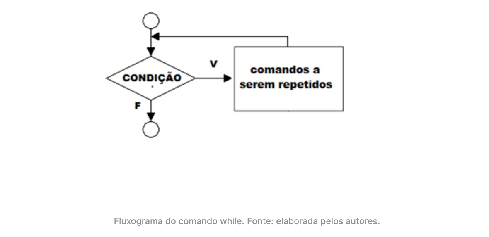
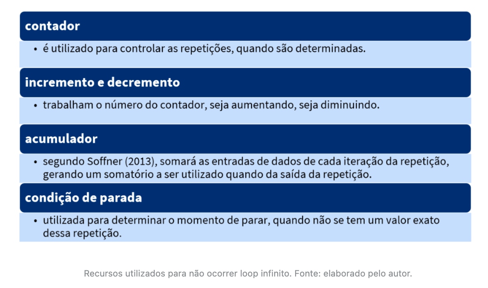
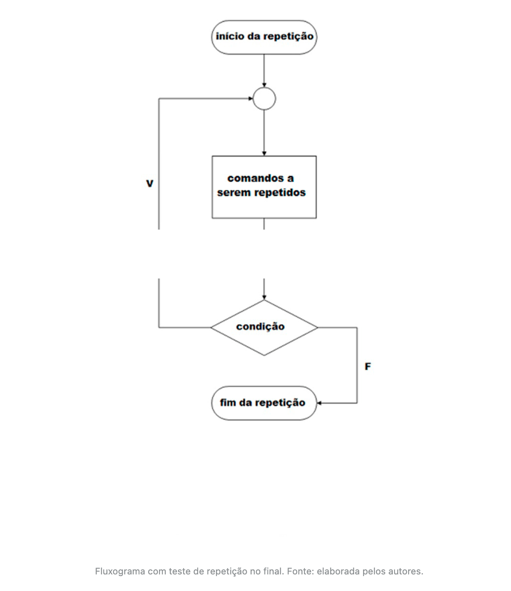

# Estruturas de repetição deterministicas


## Introdução da aula

- **Situação-problema**: Olá estudante, chegamos a mais um desafio do nosso curso, no qual você terá a oportunidade de estudar as estruturas de repetição condicionais *while* e *do/while*, seus comparativos e aplicações.
- Assim como as estruturas de decisão, as estruturas de repetição têm a função de otimizar as soluções de problemas.
- Considere que você decidiu distribuir cinco livros de computação ao final de um evento; a estrutura de repetição, por exemplo, ficaria assim: enquanto o número de pessoas for menor que cinco, você entregará um livro; depois, a distribuição será encerrada. Veja que a expressão “enquanto” foi utilizada no início da frase.
- Pois bem, para colocarmos os conhecimentos a serem aprendidos em prática, vamos analisar a seguinte situação: você deverá criar um programa em linguagem *C* para ajudar a instituição de ensino na qual você se graduou.
- Foi solicitada a elaboração de um programa que receberá as notas finais dos alunos de determinada disciplina. O professor poderá entrar com quantas notas ele desejar e, por fim, o programa deverá apresentar a média final dessa disciplina.
- Pense nas soluções e execute o código em um compilador de linguagem *C*. Apresente o código livre de erros em um documento de texto.

---


## Estrutura de repetição com teste no início - while

- Segundo Manzano (2013), para a solução de um problema, é possível utilizar a instrução *if* para tomada de decisão e para criar desvios dentro de um programa para uma condição verdadeira ou falsa. Seguindo essa premissa, vamos iniciar nossos estudos com as **repetições com teste no início –** ***while***.
- Veja na figura a seguir a forma simplificada do fluxograma do comando *while* direcionado para o teste no início.



- Como o programa será elaborado em linguagem *C*, veja a sintaxe com a repetição com teste no início:

```c
while (<condição>) {

  Comando 1;
  Comando 2;
  Comando n;
}
```

- Em alguns casos, quando utilizamos um teste no início, pode ocorrer o famoso *loop* (laço) infinito (quando um processo é executado repetidamente). Para que isso não aconteça, você poderá utilizar os seguintes recursos:



- Observe o exemplo a seguir, uma aplicação do comando *while* em um teste no início, que deverá mostrar a palavra “PROGRAMA” dez vezes:

```c
#include <stdio.h>

int main() {
  int cont = 0;

  // Será executado enquanto cont for menor que 10
  while (cont < 10) {
    printf("\n PROGRAMA");

    // incrementa cont, para que não entre em loop infinito
    cont++;
  }
  printf("\n");
  return 0;
}
```

- ***<u>Output:</u>***

```
 PROGRAMA
 PROGRAMA
 PROGRAMA
 PROGRAMA
 PROGRAMA
 PROGRAMA
 PROGRAMA
 PROGRAMA
 PROGRAMA
 PROGRAMA
```

- Duas outras formas de se representar o incremento do contador são:

  ```c
  cont = cont + 1
  // ou
  cont = cont += 1
  ```

- O próximo exemplo é para checar se a nota final de um aluno está entre 0 e 10.

```c
#include <stdio.h>

int main(void) {
  char parar;
  float nota;
  printf("\nDigite a nota final do aluno: ");
  scanf("%f", &nota);
  while (nota < 0 || nota > 10) {
    printf("\nNota inválida! Digite a nota final do aluno: ");
    scanf("%f", &nota);
  }
  return 0;
}
```

- ***<u>Output:</u>***

```
Digite a nota final do aluno: 50

Nota inválida! Digite a nota final do aluno: 5
```

- Logo após (linha 7), temos um laço *while*, cuja condição de parada é quando a nota do aluno estiver entre 0 e 10. Isto é, o laço só será encerrado quando a nota do aluno for válida.

---


## Estrutura de repetição com teste no fim - do-while

- Segundo Schildt (1997), o laço *do-while* analisa a condição ao final do laço, ou seja, os comandos são executados antes do teste de condição. Nesse caso específico, ao contrário do *while*, os comandos são executados pelos menos uma vez.
- A figura a seguir ilustra o fluxograma utilizando o teste de repetição no final:



- Observe a sintaxe para realização da repetição com teste no final:

```c
do {
  comandos;
} while (condição);
```

- Observe como ficaria o exemplo anterior, com a utilização do comando *do-while*:

```c
#include <stdio.h>

int main(void) {
  char parar;
  float nota;
  do {
    printf("\nDigite a nota final do aluno (min: 0, max: 10): ");
    scanf("%f", &nota);
  } while (nota < 0 || nota > 10);
  return 0;
}
```

- ***<u>Output:</u>***

```
Digite a nota final do aluno (min: 0, max: 10): 11

Digite a nota final do aluno (min: 0, max: 10): 5
```

- Uma diferença do exemplo apresentado para o anterior, que usava o laço *while*, é que nesse caso não é exibida uma mensagem ao usuário informando-o que a nota é inválida. Isso poderia ser facilmente resolvido, incluindo uma estrutura condicional if após a leitura da nota do aluno (linha 7), como:

```c
if (nota < 0 || nota > 10) {
  printf(“\nNota inválida! ”);
}
```

- Outro potencial uso do laço *do-while* é na implementação de menus de opções, conforme apresentado no exemplo a seguir. Você verá um programa que calcula a metragem quadrada de um terreno, usando o teste no final para criar a opção de digitar novos valores sem sair do programa:

```c
#include <stdio.h>

int main() {
  float metragem1, metragem2, resultado;
  int resp;
  metragem1 = 0;
  metragem2 = 0;
  resultado = 0;
  printf("\nC Á L C U L O    D E   M E T R O S    Q U A D R A D O S");
  do {
    printf("\n\nDigite a primeira metragem do terreno: ");
    scanf("%f", &metragem1);
    printf("\nDigite a segunda metragem do terreno: ");
    scanf("%f", &metragem2);
    resultado = metragem1 * metragem2;
    printf("\n\nO Terreno tem = %.2f m2", resultado);
    printf("\n\nDigite 1 para continuar ou 2 para sair: ");
    scanf("%d", &resp);
  } while (resp == 1);
  return 0;
}
```

- ***<u>Output:</u>***

```
C Á L C U L O    D E   M E T R O S    Q U A D R A D O S

Digite a primeira metragem do terreno: 15

Digite a segunda metragem do terreno: 10


O Terreno tem = 150.00 m2

Digite 1 para continuar ou 2 para sair: 2
```

- Na sequência dos nossos estudos, vamos trabalhar com outra aplicação das estruturas de repetição condicionais. Nesse caso, realizando um programa que simula uma conta bancária (tela de opções das transações), adaptado do livro do Soffner (2013).

```c
#include <stdio.h>

int main() {
    float soma=0;
    float valor;
    int opcao;
    do {
        printf("\n M E N U   D E  O P Ç Õ E S");
        printf("\n 1. Depósito");
        printf("\n 2. Saque");
        printf("\n 3. Saldo");
        printf("\n 4. Sair");
        printf("\n Informe uma opção: ");
        scanf("%d", &opcao);
        switch(opcao) {
            case 1:
                printf("\n Informe o valor: ");
                scanf("%f", &valor);
                soma += valor;
                break;
            case 2:
                printf("\n Informe o valor: ");
                scanf("%f", &valor);
                soma -= valor;
                break;
            case 3:
                printf("\n Saldo atual = R$ %.2f\n", soma);
                break;
            case 4:
                printf("\n Saindo...");
                break;
            default:
                printf("\n Opção inválida!");
        }
    } while (opcao != 4);
    printf("\n\n Fim das operações!");
	return 0;
}
```

- ***<u>Output:</u>***

```
M E N U   D E  O P Ç Õ E S
 1. Depósito
 2. Saque
 3. Saldo
 4. Sair
 Informe uma opção: 1

 Informe o valor: 20

 M E N U   D E  O P Ç Õ E S
 1. Depósito
 2. Saque
 3. Saldo
 4. Sair
 Informe uma opção: 2

 Informe o valor: 15

 M E N U   D E  O P Ç Õ E S
 1. Depósito
 2. Saque
 3. Saldo
 4. Sair
 Informe uma opção: 3

 Saldo atual = R$ 5.00

 M E N U   D E  O P Ç Õ E S
 1. Depósito
 2. Saque
 3. Saldo
 4. Sair
 Informe uma opção: 4

 Saindo...

 Fim das operações!
```

- Algumas variáveis podem sofrer alterações baseadas nos seus valores anteriores. Para facilitar, você pode utilizar o que chamamos de atribuição composta, que indica qual operação será realizada.
- Nesse caso, coloca-se o operador à esquerda do sinal de atribuição. Por exemplo: y += 1, que tem o mesmo efeito que y = y + 1, nesse caso, evitando colocar a variável à direita da atribuição.
- O mesmo pode ser feito com as operações de subtração, multiplicação e de divisão.

---


## Vídeoaula: Estrutura de Repetição Condicional

---


## Conclusão

- Para ampliar sua visão acerca das possibilidades de aplicação dos conhecimentos obtidos até o momento, vamos retomar a situação-problema apresentada anteriormente.

- Você deverá criar um programa em linguagem *C* que calcule a média de notas de uma disciplina, de acordo com as notas dos alunos, informadas pelo professor.

- Para resolver essa situação, é sugerida uma das possíveis soluções:

  - criar uma variável para entrada das notas, outra para acumular o valor das notas e outra para contabilizar quantas notas foram informadas;

  - após o lançamento de cada nota, solicitar ao usuário que informe se deseja continuar digitando outras notas ou não;

  - ao final, calcula-se a média e a apresenta na tela.

```c
#include <stdio.h>

int main() {
  int qtde_notas = 0, opcao;
  float nota, media, soma_notas = 0.0;

  do {
    printf("\nDigite a nota do aluno %d: ", qtde_notas + 1);
    scanf("%f", &nota);
    qtde_notas += 1;
    soma_notas += nota;
    printf("\nDigite 1 para informar outra nota ou 2 para encerrar: ");
    scanf("%d", &opcao);
  } while (opcao != 2);

  printf("\n\nQuantidade de alunos = %d", qtde_notas);
  media = soma_notas / (float)qtde_notas;
  printf("\nMédia das notas = %.2f\n", media);
  return 0;
}
```

- ***<u>Output:</u>***

```
Digite a nota do aluno 1: 20

Digite 1 para informar outra nota ou 2 para encerrar: 1

Digite a nota do aluno 2: 15

Digite 1 para informar outra nota ou 2 para encerrar: 2


Quantidade de alunos = 2
Média das notas = 17.50
```

