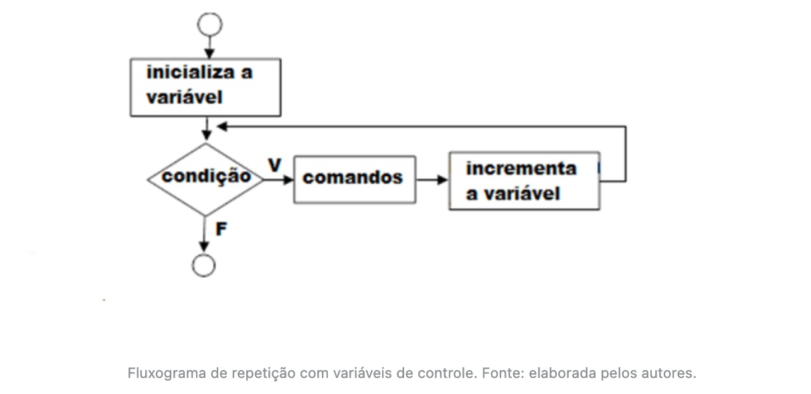
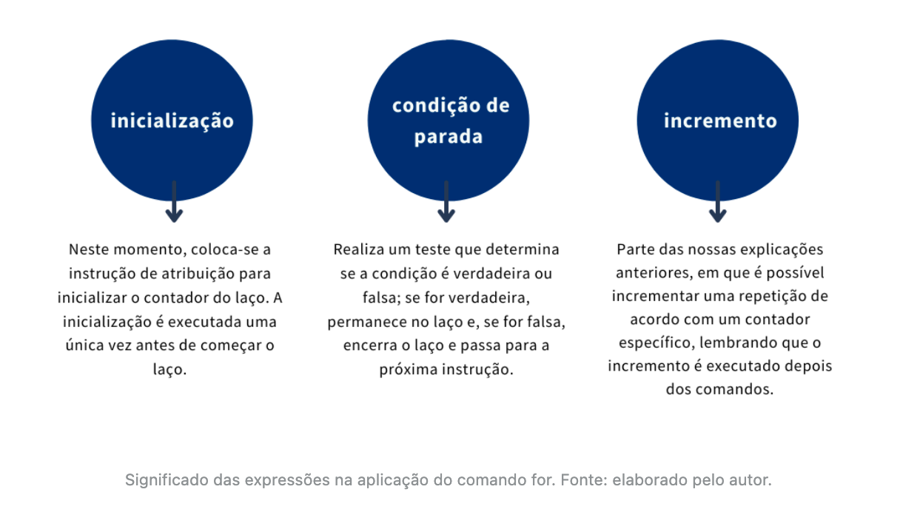
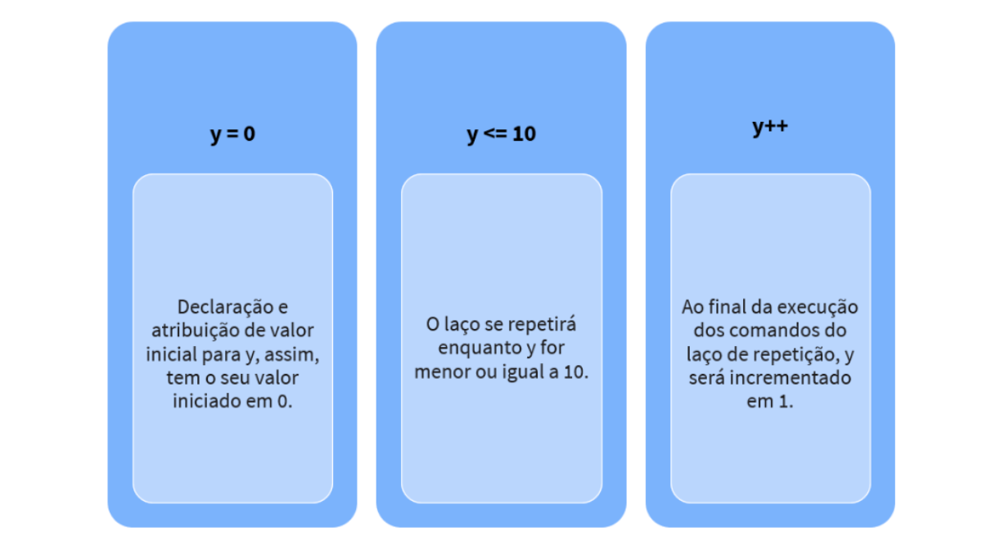

# Operações e expressões


## Introdução da aula

- Nesta aula, você terá a oportunidade de estudar a estrutura de repetição usando “*for*” (para), o histórico e as aplicações da repetição determinística, assim como o comparativo com estruturas condicionais.
- **Situação-problema**: Você, novamente, recebeu uma missão da instituição de ensino na qual se formou.
- Foi solicitado um programa em linguagem *C* para transformar o nome digitado dos alunos em letras maiúsculas, assim, caso uma pessoa digite o nome do aluno em letras minúsculas, o programa transformará automaticamente em maiúsculas. Essa é uma prática muito comum no dia a dia do desenvolvimento de software.
- Por exemplo, ao fazer a busca por um aluno da instituição usando seu nome, antes, é necessário transformar o nome informado, bem como os nomes dos alunos cadastrados no software para caixa alta (maiúsculas) ou baixa (minúsculas).
- Isso evitará que o fato de uma letra ser informada maiúscula ou minúscula prejudique a busca, ou seja, tanto faz se o usuário informou “josé” ou “José” ou “JOSÉ”; o resultado da busca deve ser sempre o mesmo.
- Outra aplicação prática desse exercício é quando se quer gerar uma lista de presença dos alunos de determinada turma. É comum sempre imprimir os nomes em caixa alta (maiúsculas), mantendo um padrão entre os nomes e facilitando a leitura do professor. Após a criação do programa, entregue o código no formato TXT para documentação.
- Qual função em linguagem *C* devemos usar para converter maiúsculas em minúsculas e vice-versa? São tantas as possibilidades de aplicação de estrutura de repetição que não podemos deixar passar esse novo desafio.

---


## Estrutura de repetição com variáveis de controle - *for*

- Esse comando – que em português significa “para”, segundo Mizrahi (2008), é geralmente usado para repetir um comando ou uma sequência de comandos um determinado número de vezes, isto é, podemos determinar quantas vezes acontecerá a repetição.
- Veja na figura a seguir como é representada a estrutura de repetição usando o comando *for*.



- A sintaxe usando a linguagem de programação em *C* fica da seguinte forma:

```c
for(inicialização; condição de parada; incremento) {
  comando ou sequência de comandos;
}
```

- Na aplicação do comando *for* você encontra três expressões separadas por ponto e vírgula. O significado de cada uma delas é apresentado a seguir:



- Para facilitar ainda mais, veja a seguinte representação:

```c
for (y = 0; y <= 10; y++)
```



- Agora, vamos aplicar essa representação em um programa que mostra uma sequência de números, em que y vai de 0 a 10. Observe a saída do código:

```c
#include <stdio.h>

int main() {
  int x, y;
  for (y = 0; y <= 10; y++) {
    printf("\ny=%d", y);
  }
  printf("\n");
  return 0;
}
```

- Output

```
y=0
y=1
y=2
y=3
y=4
y=5
y=6
y=7
y=8
y=9
y=10
```

- O incremento em um comando *for* não precisar ser unitário (de um em um). Você pode utilizar incrementos maiores para, por exemplo, imprimir todos os números pares de 0 a 10:

```c
#include <stdio.h>

int main() {
  int x, y;
  for (y = 0; y <= 10; y += 2) {
    printf("\ny=%d", y);
  }
  printf("\n");
  return 0;
}
```

- ***<u>Output:</u>***

```
y=0
y=2
y=4
y=6
y=8
y=10
```

- No código a seguir, vamos criar uma contagem regressiva de um número qualquer, digitado pelo usuário:

```c
#include <stdio.h>

int main() {
  int contador;
  printf("\nDigite um número para contagem regressiva: ");
  scanf("%d", &contador);
  for (contador; contador >= 1; contador--) {
    printf("%d ", contador);
  }
  return 0;
}
```

- ***<u>Output:</u>***

```
Digite um número para contagem regressiva: 8
8 7 6 5 4 3 2 1
```

- Você pode usar o comando *break* dentro de um laço for para uma determinada condição, forçando, assim, o término do laço. Veja o exemplo a seguir:

```c
#include <stdio.h>

int main() {
  int parar_em = 30;
  for (int i = 0; i < 100; i++) {
    if (i == parar_em) {
      break;
    }
    printf("%d ", i);
  }
}
```

- ***<u>Output:</u>***

```
0 1 2 3 4 5 6 7 8 9 10 11 12 13 14 15 16 17 18 19 20 21 22 23 24 25 26 27 28 29
```

---


## Vetores e comando continue

- Segundo Manzano (2013; 2015), vetor (*array*) é um tipo especial de variável, capaz de armazenar diversos valores “ao mesmo tempo”, usando um mesmo nome de variável.
- Vamos a outro exemplo em que armazenamos valores em um vetor. Lembre-se de que os elementos de um vetor são acessados por meio de índices, que vão de 0 à *n* – 1, em que *n* é a quantidade de elementos.

```c
#include <stdio.h>

#define VET_TAM 5

int main() {
  int num[VET_TAM];

  for (int i = 0; i < VET_TAM; i++) {
    printf("\nEntre com o número: ");
    scanf("%d", &num[i]);
    printf("\nO valor digitado foi: %d", num[i]);
  }
  return 0;
}
```

- ***<u>Output:</u>***

```
Entre com o número: 10

O valor digitado foi: 10
Entre com o número: 3

O valor digitado foi: 3
Entre com o número:
```

- Que tal usarmos o comando *for* e *while* no mesmo código? O programa a seguir encontra a primeira posição para um determinado número inserido pelo usuário. Vejamos, então, como fica a programação:

```c
#include <stdio.h>

#define VET_TAM 5

int main() {
  int vetor[VET_TAM];
  int num, i = 0, achou = 0;

  // Preenche vetor
  for (int i = 0; i < VET_TAM; i++) {
    printf("\nEntre com um número: ");
    scanf("%d", &vetor[i]);
  }

  printf("\n\nInforme o número a ser encontrado: ");
  scanf("%d", &num);

  while (i < VET_TAM) {
    if (vetor[i] == num) {
      achou = 1;
      break;
    }
    i++;
  }

  if (achou == 1) {
    printf("\nO número %d foi encontrado na posição %d do vetor", num, i);
  } else {
    printf("\nO número %d não foi encontrado no vetor", num);
  }

  return 0;
}
```

- ***<u>Output:</u>***

```
Entre com um número: 2

Entre com um número: 5

Entre com um número: 3

Entre com um número: 6

Entre com um número: 7


Informe o número a ser encontrado: 6

O número 6 foi encontrado na posição 3 do vetor
```

- Dando prosseguimento aos nossos estudos, vamos conhecer o comando *continue*. Segundo Damas (2016), um comando *continue*, dentro de um laço, possibilita que a execução de comandos corrente seja terminada, passando à próxima iteração do laço, ou seja, quando usamos o *continue* dentro de um laço, este é passado para a próxima iteração.
- Vejamos, agora, um programa que percorrerá os números de 1 a 30, imprimindo na tela apenas os números ímpares.
- Nas iterações com números pares, o comando *continue* é usado para levar o programa para a próxima iteração. As linhas 3 a 8 declaram um comando for para iterar (percorrer) entre os números 1 a 30, imprimindo seu valor da tela, conforme mostra a linha 7.
- Contudo, na linha 4 é feito um teste condicional para verificar se o número da iteração corrente, representado pela variável i, é par.
- Caso seja, então o comando continue é executado, fazendo com que o laço for vá para a próxima iteração, sem executar as linhas que estão abaixo do comando *continue*. Nesse sentido, pode-se afirmar que o programa não imprime o valor dos números pares na tela.

```c
#include <stdio.h>

int main() {
  for (int i = 1; i <= 30; i++) {
    if (i % 2 == 0) {
      continue;
    }
    printf("%d ", i);
  }
}
```

- ***<u>Output:</u>***

```
1 3 5 7 9 11 13 15 17 19 21 23 25 27 29
```

- Segundo Damas (2016), o comando *continue* poderá apenas ser utilizado dentro de laços. No entanto, o comando *break* pode ser utilizado em laços ou nas instruções *switch*. Existem outras formas de continuar uma instrução dentro do laço?

---


## Vídeoaula: Estruturas de repetição determinísticas

- `for` repete uma informação por um número fixo de vezes.
- Exemplo de contagem regressiva com entrada do usuário:

```c
#include <stdio.h>

int main() {
  int contador;

  printf("\nDigite um valor: ");
  scanf("%d", &contador);

  // observar que o for usa a var 'contador'
  // essa var tem o valor informando pelo usuário
  // depois o contador é descontado através do 'contador--'
  // até que o contador seja maior ou igual a 1
  for (contador; contador >= 1; contador--) {
    printf("%d ", contador);
  }
  printf("\n");
  return 0;
}
```

- ***<u>Output:</u>***

```
Digite um valor: 100
100 99 98 97 96 95 94 93 92 91 90 89 88 87 86 85 84 83 82 81 80 79 78 77 76 75 74 73 72 71 70 69 68 67 66 65 64 63 62 61 60 59 58 57 56 55 54 53 52 51 50 49 48 47 46 45 44 43 42 41 40 39 38 37 36 35 34 33 32 31 30 29 28 27 26 25 24 23 22 21 20 19 18 17 16 15 14 13 12 11 10 9 8 7 6 5 4 3 2 1
```

---


## Matrizes

- Matrizes são arranjos de duas ou mais dimensões. Assim como nos vetores, todos os elementos de uma matriz são do mesmo tipo, armazenando informações semanticamente semelhantes (EDELWEISS, 2014, p. 196).  Veja como fica a sintaxe de matrizes de duas dimensões:

```c
// M representa a quantidade de linhas
// N representa a quantidade de colunas

tipo variável[M][N]
```

- Importante lembrar que:
  - em qualquer variável composta, o índice começa por zero, então, em uma matriz, o primeiro espaço para armazenamento é sempre (0,0), ou seja, índice 0, tanto para linha como para coluna.
  - não é obrigatório que todas as posições sejam ocupadas, sendo possível declarar uma matriz com 10 linhas (ou colunas) e usar somente uma.
- Observe o programa a seguir, temos uma matriz 3x3 em que os valores são lançados de acordo com a linha e coluna e que é montada no formato da matriz. Nesse código, na linha 5 é declarada uma matriz 3x3.

```c
#include <stdio.h>

int main() {
  int linha, coluna;
  int matriz[3][3];
  for (linha = 0; linha < 3; linha++) {
    for (coluna = 0; coluna < 3; coluna++) {
      printf("\nDigitar os valores da matriz para [linha %d, coluna %d]: ", linha + 1, coluna + 1);
      scanf("%d", &matriz[linha][coluna]);
    }
  }
  printf("\n\nVeja a sua Matriz\n");
  for (linha = 0; linha <= 2; linha++) {
    for (coluna = 0; coluna < 3; coluna++) {
      printf("%d\t", matriz[linha][coluna]);
    }
    printf("\n");
  }
  return 0;
}
```

- ***<u>Output:</u>***

```
Digitar os valores da matriz para [linha 1, coluna 1]: 3
Digitar os valores da matriz para [linha 1, coluna 2]: 5
Digitar os valores da matriz para [linha 1, coluna 3]: 8
Digitar os valores da matriz para [linha 2, coluna 1]: 4
Digitar os valores da matriz para [linha 2, coluna 2]: 6
Digitar os valores da matriz para [linha 2, coluna 3]: 8
Digitar os valores da matriz para [linha 3, coluna 1]: 3
Digitar os valores da matriz para [linha 3, coluna 2]: 4
Digitar os valores da matriz para [linha 3, coluna 3]: 5

Veja a sua Matriz
3   5   8
4   6   8
3   4   5
```

- Para encerrar a aula, vamos trabalhar em um problema sobre matrizes: a ideia é descobrir se determinada matriz é diagonal ou não.
- Uma matriz diagonal é definida como uma matriz em que todos os elementos cujo i ≠ j são nulos. Esse problema utiliza estruturas de decisão e repetição e uma das possíveis soluções para o problema apresentado no código a seguir:

```c
#include <stdio.h>

int main() {
  int linha, coluna;
  int matriz[3][3];
  int eh_diagonal = 1;

  for (linha = 0; linha < 3; linha++) {
    for (coluna = 0; coluna < 3; coluna++) {
      printf("\nDigitar os valores da matriz para [linha %d, coluna %d]: ", linha + 1, coluna + 1);
      scanf("%d", &matriz[linha][coluna]);
    }
  }
  for (linha = 0; linha < 3; linha++) {
    for (coluna = 0; coluna < 3; coluna++) {
      if (coluna != linha && matriz[linha][coluna] != 0) {
        eh_diagonal = 0;
      }
    }
  }

  if (eh_diagonal == 1) {
    printf("\n\nSua matriz é diagonal!\n");
  } else {
    printf("\n\nSua matriz não é diagonal!\n");
  }
  return 0;
}
```

- ***<u>Output:</u>***

```
Digitar os valores da matriz para [linha 1, coluna 1]: 1
Digitar os valores da matriz para [linha 1, coluna 2]: 0
Digitar os valores da matriz para [linha 1, coluna 3]: 0
Digitar os valores da matriz para [linha 2, coluna 1]: 0
Digitar os valores da matriz para [linha 2, coluna 2]: 1
Digitar os valores da matriz para [linha 2, coluna 3]: 0
Digitar os valores da matriz para [linha 3, coluna 1]: 0
Digitar os valores da matriz para [linha 3, coluna 2]: 0
Digitar os valores da matriz para [linha 3, coluna 3]: 1

Sua matriz é diagonal!
```

- Um exemplo de output com código modificado para também mostrar a matriz pronta:

```
Digitar os valores da matriz para [linha 1, coluna 1]: 1
Digitar os valores da matriz para [linha 1, coluna 2]: 0
Digitar os valores da matriz para [linha 1, coluna 3]: 0
Digitar os valores da matriz para [linha 2, coluna 1]: 0
Digitar os valores da matriz para [linha 2, coluna 2]: 1
Digitar os valores da matriz para [linha 2, coluna 3]: 0
Digitar os valores da matriz para [linha 3, coluna 1]: 0
Digitar os valores da matriz para [linha 3, coluna 2]: 0
Digitar os valores da matriz para [linha 3, coluna 3]: 1

Veja a sua Matriz
1   0   0
0   1   0
0   0   1

Sua matriz é diagonal!
```

- Retomando o exemplo que demos no início desta aula, suponha um sistema de compras de passagens aéreas.
- Por exemplo, considerando a matriz a seguir, temos o seguinte:
  1. o primeiro horário de voo disponibiliza 4 poltronas, sendo que as três primeiras estão ocupadas e a 4ª poltrona está livre.
  2. o segundo horário conta com 5 poltronas, contudo, todas já estão ocupadas.
  3. e o terceiro e último horário tem apenas 2 poltronas e todas encontram-se livres.


- Considerando a matriz anterior como entrada, leia o horário do voo solicitado pelo usuário (1, 2 ou 3) e informe uma das seguintes opções: “Seu voo foi reservado com sucesso!” ou “Não há poltronas disponíveis nesse voo!”. Caso o voo seja agendado, a matriz de informações do voo deve ser atualizada. Para ficar mais interessante, crie um menu de opções bem simples, contendo “Reservar voo” e “Sair”.

```c
#include <stdio.h>
int main() {
  // Matriz inicial
  int mat[3][5] = {
  1, 1, 1, 0, -1,
  1, 1, 1, 1, 1,
  0, 0, -1, -1, -1
  };

  int opcao;
  int numVoo;
  int reservou;

  do {
    printf("\n1 - Reservar voo\n2 - Sair\nInforme a opção desejada: ");
    scanf("%d", &opcao);
    switch (opcao) {
    case 1:
      printf("Informe o número do voo (1-3): ");
      scanf("%d", &numVoo);
      reservou = 0;
      if (numVoo >= 1 && numVoo <= 3) {
        for (int i = 0; i < 5 && reservou == 0; i++) {
          if (mat[numVoo - 1][i] == 0) {
            reservou = 1;
            mat[numVoo - 1][i] = 1;
          }
        }
        if (reservou == 1) printf("\nSeu voo foi reservado com sucesso!");
        else printf("\nNão há poltronas disponíveis nesse voo!");
      } else {
        printf("Opção inválida!");
      }
      break;
    case 2:
      printf("\nSaindo...");
      break;
    default: printf("Opção inválida!");
    }
  } while (opcao != 2);
  return 0;
}
```

- ***<u>Output:</u>***

```
1 - Reservar voo
2 - Sair
Informe a opção desejada: 3
Opção inválida!
1 - Reservar voo
2 - Sair
Informe a opção desejada: 1
Informe o número do voo (1-3): 2

Não há poltronas disponíveis nesse voo!
1 - Reservar voo
2 - Sair
Informe a opção desejada: 2

Saindo...
```

---


## Vídeoaula: Vetores e Matrizes

- Vetores apenas valores do mesmo tipo. Matrizes a mesma coisa.
- Não é obrigatório que todas as posições sejam usadas.
- Mas é importante não alocar muito mais que a previsão de uso pois isso aloca memória desnecessária

---


## Vídeoaula: Exercício Estruturas de repetição determinísticas

- Verdadeiro ou Falso?

```
(V) O do-while analisa a condição ao final do lago, ou seja, ### Acertei
    os comandos são executados antes do teste de condição;
(F) Todo loop deve ter uma variável de controle; ### Errei
(V) No while os comandos serão repetidamente executados enquanto ### Acertei
    uma condição verdadeira for verificada, somente após a sua
    negativa essa condição será interrompida;
```

- Todo loop deve ter uma variável de controle; `(V)` ou então ficará em um loop infinito.

---


## Conclusão

- Acreditamos que você já esteja preparado para solucionar o desafio dado pela instituição de ensino. Foi solicitado um programa em linguagem *C* para transformar o nome digitado dos alunos em letras maiúsculas.
- Para resolver essa questão, é importante que você esteja atento às seguintes condições antes de iniciar a programação:
  - Utilizar a biblioteca *ctype.h* dentro da linguagem *C*, que proporcionará o uso de funções e macros para trabalhar com caracteres.
- No nosso desafio, especificamente, podemos utilizar a função *toupper*, que converte os caracteres minúsculos em maiúsculos. Agora sim, vamos à programação:

```c
#include <ctype.h>
#include <stdio.h>

#define NOME_TAM 30

int main() {
  char nome[NOME_TAM];
  int i;
  printf("\nDigite o nome do(a) aluno(a): ");
  fgets(nome, NOME_TAM, stdin);
  printf("\nNome ANTES da mudança: %s", nome);

  for (int i = 0; i < NOME_TAM; i++) {
    nome[i] = toupper(nome[i]);
  }

  printf("\nNome DEPOIS da mudança: %s\n", nome);
  return 0;
}
```

- ***<u>Output:</u>***

```
Digite o nome do(a) aluno(a): Vitor Ugo Roda

Nome ANTES da mudança: Vitor Ugo Roda

Nome DEPOIS da mudança: VITOR UGO RODA
```

