# Introdução aos algoritmos


## Introdução a unidade

- Nesta unidade, você terá o prazer de conhecer uma empresa de tecnologia de informação cujo foco principal é o desenvolvimento de softwares para instituições de ensino.

---


## Introdução da aula

- Algoritmo é uma sequência finita de passos que podem levar à criação e execução de determinada tarefa com a intenção de resolver um problema (FORBELLONE; EBERSPÄCHER, 2005).
- Você recebeu a demanda de criar uma funcionalidade para o software, que consiste em detectar se um filme pode ou não ser locado pelo cliente, com base em sua idade e na classificação indicativa do filme.
- Construa um algoritmo que receba como entradas a idade do cliente e a classificação indicativa dos filmes que ele pretende locar. 
- Logo após, o programa deve processar essas informações e mostrar na tela do computador um dos possíveis resultados: "Este filme não é indicado para sua faixa etária" ou "Este filme é indicado para sua faixa etária".
- O algoritmo deverá ser elaborado nas formas descritas a seguir:
  - linguagem natural.
  - diagrama de blocos (fluxograma).
  - pseudocódigo.
  
---


## Conceitos, aplicações e tipos de algoritmos

- A figura -- Exemplo de aplicação de algoritmos --, ilustra um exemplo de aplicação desse tipo de abordagem. Imagine que você está no ponto azul e quer chegar ao vermelho: você terá algumas alternativas de rota, e o programa fará a escolha conforme os critérios estabelecidos por você.

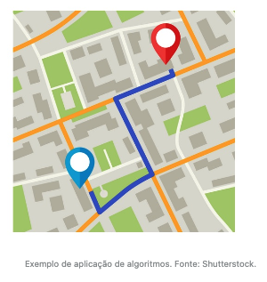

- Berg e Figueiró (1998) descrevem algoritmos como uma sequência ordenada de passos que deve ser seguida para atingir um objetivo.
- Conforme mencionado, para qualquer tarefa a ser executada no dia a dia podemos desenvolver um algoritmo. Como exemplo, tomemos a sequência de passos para o cozimento de arroz, que pode ser a seguinte:

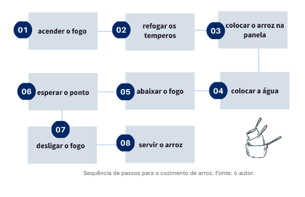

- Para melhor entendimento dos algoritmos é necessário dividi-los em três partes:

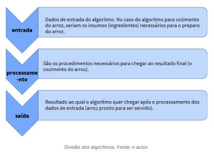

- Exercitando lógica e algoritmos: Veja se consegue completar todos os desafios do jogo "[Labirinto](https://blockly.games/maze?lang=pt-br#ue6x7c)".

---


## Linguagem natural

- Segundo Santos (2001), a linguagem natural é uma forma de comunicação entre as pessoas de diversas línguas, que pode ser falada, escrita ou gesticulada, entre outras formas de comunicação.
- Para reforçar esse conceito, podemos considerar o cadastro das notas dos alunos de um curso.

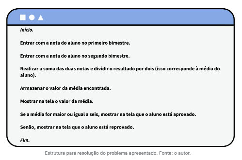

---


## Diagrama de blocos (fluxograma)

- Segundo Manzano, Franco e Villar (2015), podemos caracterizar diagrama de blocos como um conjunto de símbolos gráficos, em que cada um desses símbolos representa ações específicas a serem executadas pelo computador. 
- O quadro a seguir mostra os principais símbolos utilizados para se descrever um algoritmo.

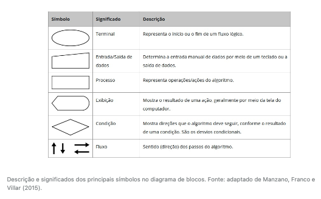

- A figura -- Diagrama de blocos (fluxograma) --, ilustra o diagrama com o algoritmo descrito em linguagem natural, que calcula a média de notas e a situação de um aluno, representado por meio de um diagrama de blocos.

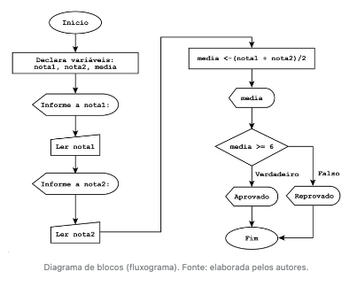

- Algumas dicas para construir um diagrama de blocos (fluxograma) são as seguintes:
  - estar atento à sequência das instruções.
  - certificar-se de que o diagrama de blocos (fluxograma) comece de cima para baixo e da esquerda para direita.
  - ficar atento para não cruzar as linhas dos fluxos.
- Outro exemplo que podemos destacar é a operação em um caixa eletrônico.

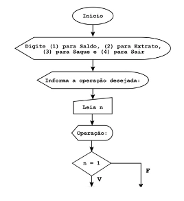

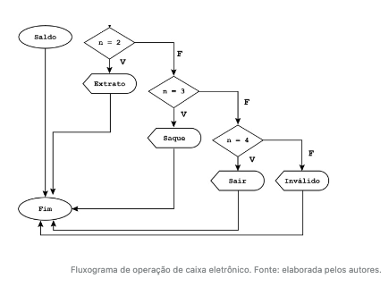

- Ainda a respeito do exemplo da figura -- Fluxograma de operação de caixa eletrônico --, para que o fluxograma não fique muito extenso, dificultando seu entendimento, você pode tratar cada operação bancária em um fluxograma à parte.
- A figura ilustra o exemplo de fluxograma que trata da operação de saque em um sistema bancário.

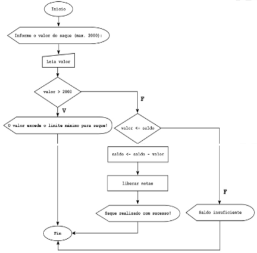

- Observando o fluxograma que representa a operação de saque em um sistema bancário, apresentado na figura -- Fluxograma da operação de saque --, como você alteraria o fluxograma para que o usuário possa escolher informar ou não um novo valor, caso o valor atualmente informado por ele seja inválido (ou seja, exceda o limite máximo ou seja maior do que o saldo atual do cliente)?

---


## Vídeoaula: Fundamentos a Algoritmos e das Linguagens de Programação

- Iremos trabalhar com a linguagem de alto nível C.
- Algoritmo: sequência ordenada de passos e importante:
  - passos finitos;
  - sem redundância;
  - sem subjetividade;
  - deve ser claro e objetivo;
- Algoritmos podem ser descritos como:
  - descrição narrativa
  - fluxograma
  - pseudocódigo

---


## Pseudocódigo

- Segundo Aguilar (2011), o pseudocódigo corresponde à escrita de um algoritmo em palavras similares ao inglês ou ao português, com o intuito de facilitar a interpretação e o desenvolvimento de um programa.

| Estruturas     | Descrição                          |
| -------------- | ---------------------------------- |
| `Escreva("")`  | Imprime uma mensagem na tela.      |
| `Leia()`       | Lê valores digitados no teclado.   |
| `<-`           | Comando de atribuição.             |
| `inicio`       | Inicia o algoritmo/programa.       |
| `fimalgoritmo` | Finaliza o algoritmo.              |
| `var`          | Realiza a declaração de variáveis. |
| `algoritmo`    | Indica o início do algoritmo.      |

- É importante estar atento para algumas regras básicas ao se utilizar pseudocódigos:
  - escolher um nome para identificar seu algoritmo;
  - avaliar as variáveis, dar atenção aos seus tipos e características;
  - descrever de forma clara o que será armazenado e se as variáveis destinadas a essa informação estão corretas;
  - verificar se as instruções fazem sentido e se têm uma sequência lógica;
  - avaliar o resultado e, quando pertinente, mostrá-lo na tela;
  - finalizar o algoritmo.

- Recordando o exemplo que calcula a média das notas de aluno, observe o pseudocódigo a seguir:

```pseudocode
Algoritmo "Calcula média de notas"
// Disciplina  : [Introdução aos Algoritmos]
// Professor   : Vanessa Leite
// Descrição   : Calcula média das notas de um aluno
// Autor(a)    : Vitor Ugo Roda da Rosa Jr
// Data atual  : 05/06/2022
Var
// Seção de Declarações das variáveis 
   nota1, nota2, media: real

Inicio
// Seção de Comandos, procedimento, funções, operadores, etc... 
   Escreva("Informe a nota 1..: ")
   Leia(nota1)
   Escreva("Informe a nota 2..: ")
   Leia(nota2)
   media <- (nota1 + nota2)/2
   Escreva(media)
   Se(media >= 6) então
        Escreva("Aprovado!")
   senão
        Escreva("Reprovado!")
   fimse
Fimalgoritmo
```

- Exemplo de pseudocódigo em `visualg` que imprime o maior número:

```pseudocode
Algoritmo "imprime o maior"
// Disciplina  : [Introdução aos Algoritmos]
// Professor   : Vanessa Leite
// Descrição   : Imprime o maior número entre dois informados
// Autor(a)    : Vitor Ugo Roda da Rosa Jr
// Data atual  : 05/06/2022
Var
// Seção de Declarações das variáveis 
   num1, num2, maior: real

Inicio
// Seção de Comandos, procedimento, funções, operadores, etc... 
   Escreva("Digite o primeiro número..: ")
   Leia(num1)
   Escreva("Digite o segundo número...: ")
   Leia(num2)
   Se(num1 >= num2) então
        maior <- num1
   senão
        maior <- num2
   fimse
   Escreva("Maior número: ", maior)
Fimalgoritmo
```

---


## Conceitos de linguagem de programação

- A Linguagem de Programação (LP) pode ser entendida como um conjunto de palavras (vocabulário) e um conjunto de regras gramaticais (para relacionar essas palavras) usados para instruir o sistema de computação a realizar tarefas específicas e, com isso, criar os programas.
- Segundo Tucker (2010), um paradigma de programação está relacionado a um padrão de soluções de problemas, os quais, por sua vez, estão relacionados a uma determinada linguagem de programação. Ainda segundo o autor, quatro paradigmas de programação tiveram sua evolução reconhecida nas últimas décadas:

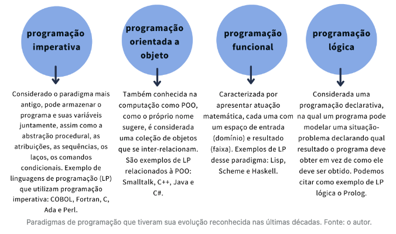

---


## Vídeoaula: Pseudocódigo

- Diferente da linguagem natural, usa um Português "estruturado"

---


## Vídeoaula: Exercício algoritmos

- Verdadeiro ou Falso?

```
(F) Só existe uma única solução para um algoritmo; ### Acertei
(V) O fluxograma é uma representação gráfica de um algoritmo; ### Acertei
(F) Todas as variáveis possuem o mesmo tipo; ### Acertei
```

---


## Conclusão

- De acordo com a situação-problema, você recebeu a missão de desenvolver uma nova funcionalidade para o software da locadora cliente da empresa para a qual você trabalha. Para tal, como primeira proposta, você deverá elaborar um algoritmo utilizando a **linguagem natural, diagramas de blocos (fluxogramas) e pseudocódigos**.
- Você recebeu a demanda de criar uma funcionalidade para o software, que consiste em detectar se um filme pode ou não ser locado pelo cliente, com base em sua idade e na classificação indicativa do filme.
- Construa um algoritmo que receba como entradas a idade do cliente e a classificação indicativa dos filmes que ele pretende locar. 
- Logo após, o programa deve processar essas informações e mostrar na tela do computador um dos possíveis resultados: "Este filme não é indicado para sua faixa etária" ou "Este filme é indicado para sua faixa etária".
- O algoritmo deverá ser elaborado nas formas descritas a seguir:
  - linguagem natural.
  - diagrama de blocos (fluxograma).
  - pseudocódigo.

---

### Linguagem natural

- verificar a idade do cliente
- verificar a classificação indicativa do filme
- caso o cliente tenha a idade dentro da classificação indicativa, informar que "Este filme é indicado para sua faixa etária".
- senão informar que "Este filme não é indicado para sua faixa etária"

---

### Diagrama de blocos (fluxograma)

- criado usando o [app.creately.com](app.creately.com)
- nome do arquivo: `introducao-aos-algoritmos-locadora-feature-1`

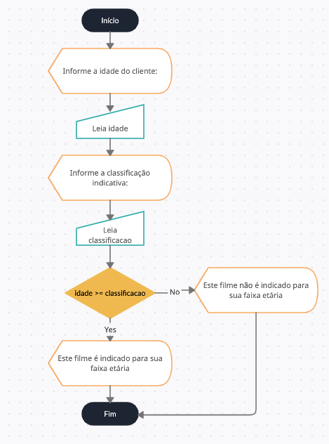

---

### Pseudocódigo

```pseudocode
Algoritmo "classificação indicativa"
// Disciplina  : [Introdução aos Algoritmos]
// Professor   : Vanessa Leite
// Descrição   : Verifica se um filme pode ser locado com base na
//               idade e na classificação indicativa do filme
// Autor(a)    : Vitor Ugo Roda da Rosa Jr
// Data atual  : 05/06/2022
Var
// Seção de Declarações das variáveis 
   idade, classificacao: real

Inicio
// Seção de Comandos, procedimento, funções, operadores, etc... 
   Escreva("Informe a idade do cliente...........: ")
   Leia(idade)
   Escreva("Informe a classificação indicativa...: ")
   Leia(classificacao)
   Se(idade >= classificacao) então
        Escreva("Este filme é indicado para sua faixa etária")
   senão
        Escreva("Este filme NÃO é indicado para sua faixa etária")
   fimse
Fimalgoritmo
```

