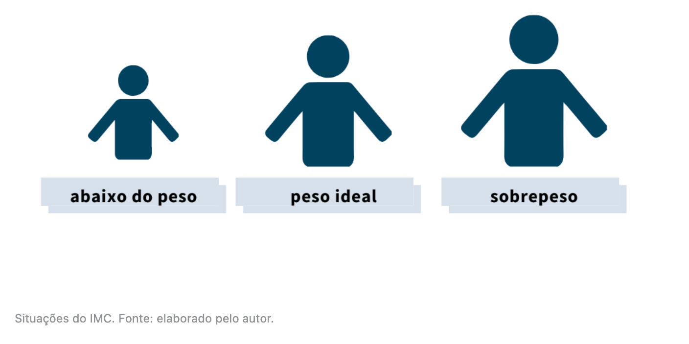
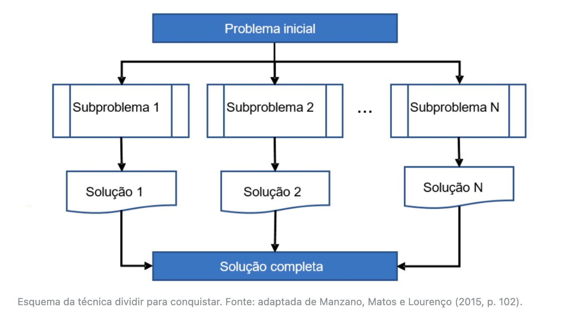

# O que são funções ou procedimentos?


## Introdução a unidade

- Tanto o desenvolvimento quanto a manutenção de um sistema só são realizáveis porque as funcionalidades são divididas em “blocos”, que são chamados de funções ou procedimentos, assunto central desta unidade de estudo, o qual te habilitará a criar soluções computacionais com tais recursos.
- Nesta primeira aula você aprenderá a criar funções que retornam valores. Na segunda aula avançaremos com as funções que, além de retornar, também recebem valores. Por fim, na terceira aula, veremos uma classe especial de funções, chamadas de recursivas.

---


## Introdução da aula

- Situação-problema: Você foi contratado por um laboratório de pesquisa que presta serviço terceirizado para atuar juntamente com diversos profissionais. Seu primeiro trabalho será com o núcleo de nutricionistas.  Eles receberam uma demanda da construtora local para calcular o IMC (Índice de Massa Corporal) de um indivíduo e dizer qual é a sua situação. Há três tipos de situações:



- A escolha de qual situação retornar depende do IMC do indivíduo, que é calculado pela fórmula **IMC = Peso / Altura²**. A regra para escolher a situação está especificada no quadro - Regras para escolha da situação do indivíduo com base em seu IMC.

| Regra              | Situação       |
| ------------------ | -------------- |
| IMC < 18.5         | Abaixo do peso |
| 18.5 <= IMC < 24.9 | Peso ideal     |
| IMC >= 24.9        | Sobrepeso      |

---


## Funções

- A ideia de criar programas com blocos de funcionalidades vem de uma técnica de projeto de algoritmos chamada *dividir para conquistar* (MANZANO; MATOS; LOURENÇO, 2015). A ideia é simples: dado um problema, este deve ser dividido em problemas menores, o que facilita a resolução e organização. A técnica consiste em três passos (figura - Esquema da técnica *dividir* para conquistar):
  1. **dividir**: quebrar um problema em outros subproblemas menores. “Solucionar pequenos problemas, em vez de um grande problema, é, do ponto de vista computacional, supostamente mais fácil” (MANZANO; MATOS; LOURENÇO, 2015, p. 102).
  2. **conquistar**: usar uma sequência de instruções separada, para resolver cada subproblema.
  3. **combinar**: juntar a solução de cada subproblema para alcançar a solução completa do problema original.



- Uma função é definida como um trecho de código escrito para solucionar um subproblema (SOFFNER, 2013). Esses blocos são escritos tanto para dividir a complexidade de um problema maior quanto para evitar a repetição de códigos. Essa técnica também pode ser chamada de **modularização**, ou seja, um problema será resolvido em diferentes módulos (MANZANO, 2015).

---


## Sintaxe para criar funções e local da função

- Para criar funções utiliza-se a seguinte sintaxe:

```c
<tipo de retorno/dado> <nome> (<parâmetros>) {
	<comandos da função>
	<retorno> // não obrigatório
}
```

- Em qual parte do código a função deve ser programada? A função *main()*, que traduzindo significa *principal*, é de uso obrigatório em várias linguagens de programação, por exemplo, em *C*, em Java e em C#. Ela é usada para identificar qual é a rotina principal do programa e por onde a execução deve começar. Na linguagem *C*, vamos adotar sempre a criação das funções (sub-rotinas) antes da função *main()*, por uma questão de praticidade e conveniência.
- Veja no código — Programa com a função *somar()* —, um programa que utiliza uma função para calcular a soma entre dois números e, a seguir, sua explicação detalhada.

```c
#include <stdio.h>

int somar() {
  return 2 + 3;
  }

int main() {
  int resultado = 0;
  resultado = somar();
  printf("O resultado da função é = %d\n", resultado);
  return 0;
}
```

- Outra característica da utilização de funções é que elas “quebram” a linearidade de execução, pois a execução pode “dar saltos” quando uma função é invocada (SOFFNER, 2013).
- Na função *calcular()* é solicitado um valor ao usuário (linha 5), armazenado em uma variável (linha 6) e retornado o valor multiplicado por ele mesmo (linha 7). Após retornar o valor, a execução do programa “volta” para a linha 10, pois nesse ponto a função foi chamada. O resultado da função é armazenado na variável *resultado* e impresso na linha 13.

```c
#include <stdio.h>

float calcular() {
  float num;
  printf("\nDigite um número: ");
  scanf("%f", &num);
  return num * num;
}

int main() {
  float resultado = 0;
  resultado = calcular();
  printf("\nO quadrado do número digitado é %.2f \n", resultado);
  return 0;
}
```

---


## Vídeoaula: Funções e Recursividade

- Função: trecho de código escrito para solucionar um subproblema;
  - Dividir a complexidade de um problema maior;
  - Evitar repetição de código;
  - Modularização;

---


## O uso de funções com ponteiros na linguagem C

### <u>Rever essa aula!</u>

- Você viu que uma função pode retornar um número inteiro, um real e um caractere; mas e um vetor? Será possível retornar? A resposta é sim! Para isso, devemos utilizar **ponteiros** (ou apontador, como alguns programadores o chamam). Não é possível criar funções como *int[10] calcular()*, onde *int[10]* quer dizer que a função retorna um vetor com 10 posições. A única forma de retornar um vetor é por meio de um ponteiro (MANZANO, 2015).
- Para exemplificar o uso desse recurso vamos implementar uma função, que cria um vetor de dez posições e os preenche com valores aleatórios, imprime os valores e posteriormente passa esse vetor para “quem” chamar a função.

```c
#include <stdio.h>

int *gerarRandomico() {
  static int r[10];
  int a;

  for (a = 0; a < 10; a++) {
    r[a] = rand() % 100;
    printf("\nr[%d] = %d", a, r[a]);
  }
  return r;
}

int main() {
  int *p;
  int i;

  p = gerarRandomico();

  for (i = 0; i < 10; i++) {
    printf("\np[%d] = %d", i, p[i]);
  }
  printf("\n");
  return 0;
}
```

- Veja no código – Função para alocar memória dinamicamente: a função *alocar()* foi criada da linha 4 até 7 e seu tipo de retorno foi especificado como *int**; isso significa que o espaço será alocado para guardar valores inteiros. Veja que na linha 8 foi criado um ponteiro inteiro, chamado *num*, e a função *alocar()* foi chamada, tendo seu resultado armazenado no ponteiro *num*.

```c
#include <stdio.h>
#include <stdlib.h>

int *alocar() {
  int *memoria = (int *)malloc(sizeof(int));
  return memoria;
}

int main() {
  int *num = alocar();
  if (num != NULL) {
    printf("\nInforme um número inteiro: ");
    scanf("%d", num);
    printf("\nNúmero informado: %d\n", *num);
  }
  return 0;
  ;
}
```

---


## Vídeoaula: Funções com Ponteiros

### <u>Rever essa aula!</u>

---


## Conclusão

- Um cliente deseja uma calculadora de IMC (Índice de Massa Corporal). Os nutricionistas lhe passaram a fórmula para calcular o IMC com base no peso e na altura do indivíduo. Eis algumas dicas para resolver o problema:

  1. crie duas variáveis para armazenar valores reais, pois o peso e a altura certamente não serão inteiros.
  2. leia o valor dessas variáveis dentro da função que calcula o IMC.
  3. retorne o valor do IMC.
  4. na função principal, chame a função que calcula o IMC e guarde seu retorno em uma variável inteira.
  5. use uma estrutura condicional (if-else if-else) para identificar e imprimir na tela a situação do indivíduo.

  ```c
  #include <stdio.h>

  float calcularIMC() {
    float peso, altura, imc;

    printf("\nInforme seu peso (em Kg): ");
    scanf("%f", &peso);
    printf("\nInforme sua altura (em metros): ");
    scanf("%f", &altura);

    imc = peso / (altura * altura);

    return imc;
  }

  int main() {
    float imc = calcularIMC();

    if (imc < 18.5)
      printf("\nIMC = %.2f, Situação: Abaixo do peso!", imc);
    else if (imc < 24.9)
      printf("\nIMC = %.2f, Situação: Peso ideal!", imc);
    else
      printf("\nIMC = %.2f, Situação: Sobrepeso!", imc);
    printf("\n");
  }
  ```


