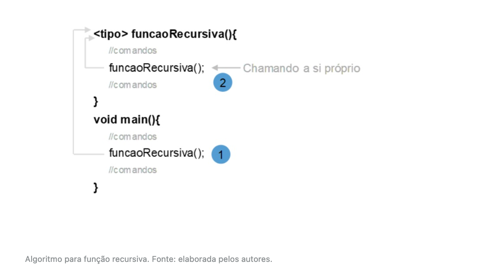
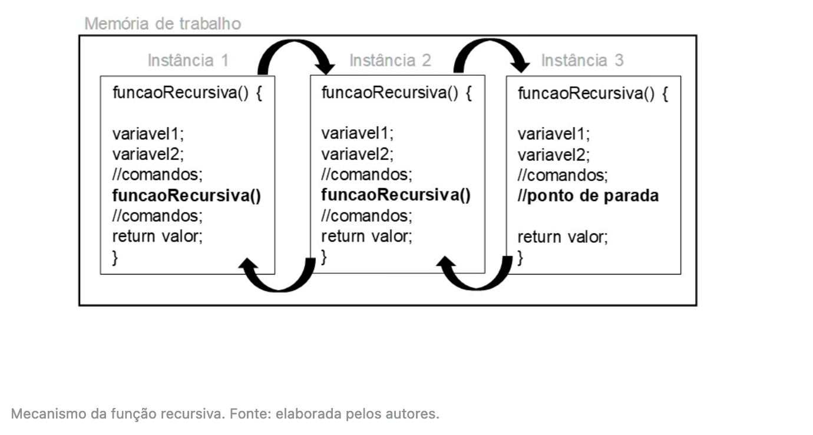
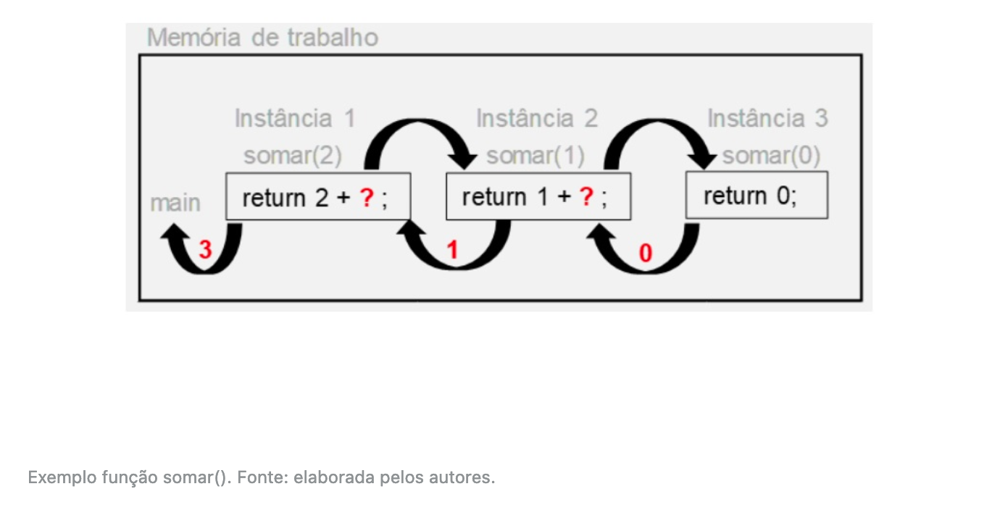

# Recursividade


## Introdução da aula

- Nesta aula, você aprenderá o que é uma  função recursiva, como ela deve ser implementada e qual sua relação com  as estruturas iterativas.
- Situação problema:
- Após trabalhar com a equipe de  nutricionistas e estatísticos, agora é hora de enfrentar um novo desafio com a equipe de matemáticos do laboratório em que atua.
- Foi solicitado a você implementar um  programa que calcula se um número é primo ou não, ou seja, se esse  número é divisível apenas por 1 e por ele mesmo. Dessa forma, você  deverá entregar o arquivo compilado para que eles possam utilizá-lo.

---


## Função Recursiva

- Nesta unidade, apresentamos as  funções. Vimos como criar uma função, qual sua importância dentro de uma implementação e estudamos a saída de dados de uma função, bem como a  entrada, feita por meio dos parâmetros.
- Entre as funções existe uma categoria especial chamada de **funções recursivas**. Para começarmos a nos apropriar dessa nova técnica de programação, primeiro vamos entender o significado da palavra recursão.
- Nessa técnica, uma função é dita  recursiva quando ela chama a si própria ou, nas palavras de Soffner:  “Recursividade é a possibilidade de uma função chamar a si mesma”  (SOFFNER, 2013, p. 107).
- Observe a figura - Algoritmo para função recursiva. Nela, ilustramos a construção da função, bem como a chamada  dela, primeiro na função principal e depois dentro dela mesma.



- Embora a sintaxe da função recursiva  seja similar à das não recursivas, o funcionamento de ambas é bastante  distinto e o mau uso dessa técnica pode acarretar uso indevido de  memória, muitas vezes chegando a travar a aplicação e o sistema  (MANZANO, 2015).
- Para entender o processo, vamos estabelecer alguns pontos de atenção:
  - a função recursiva chama a si própria até que um ponto de parada seja  estabelecido. O ponto de parada poderá ser alcançado por meio de uma  estrutura condicional ou por meio de um valor informado pelo usuário.
  - uma função apresenta em seu corpo variáveis e comandos, os quais são  alocados na memória de trabalho. No uso de uma função recursiva, os  recursos (variáveis e comandos) são alocados (instanciados) em outro  local da memória, ou seja, para cada chamada da função, novos espaços  são destinados à execução do programa. E é justamente por esse motivo  que o ponto de parada é crucial.
  - as variáveis criadas em cada instância da função na memória são  independentes, ou seja, mesmo as variáveis tendo nomes iguais, cada uma  tem seu próprio endereço de memória e a alteração do valor em uma não  afetará a outra.
- Para te auxiliar na compreensão desse mecanismo observe a figura – Mecanismo da função recursiva. A instância 1 representa a primeira chamada à função *funcaoRecursiva()*, esta, por sua vez, tem em seu corpo um comando que invoca a si mesma;  nesse momento é criada a segunda instância dessa função na memória de  trabalho.
- Veja que um novo espaço é alocado,  com variáveis e comandos, e, como a função é recursiva, novamente ela  chama a si mesma, criando, então, a terceira instância da função.
- Dentro da terceira instância, uma  determinada condição de parada é satisfeita, nesse caso, a função deixa  de ser instanciada e passa a retornar valores.



- A partir do momento que a função  recursiva alcança o ponto de parada, cada instância da função passa a  retornar seus resultados para a instância anterior (a que fez a  chamada).
- Toda função recursiva deve ter uma  instância com um caso que interromperá a chamada a novas instâncias.  Essa instância é chamada de **caso base**, pois representa o caso mais simples, que resultará na interrupção.

---


## Função Recursiva Somatória

- Vamos implementar uma função recursiva  que faz a somatória dos antecessores de um número inteiro positivo,  informado pelo usuário, ou seja, se o usuário digitar 5, o programa  deverá retornar o resultado da soma 5 + 4 + 3 + 2 + 1 + 0.
- Com base nesse exemplo, você consegue  determinar quando a função deverá parar de executar? Veja, a função  deverá somar até o valor zero, portanto esse será o critério de parada.

```c
#include <stdio.h>

int somar(int valor) {
  if (valor == 0) {
    // critério de parada
    return valor;
  } else {
    // chamada recursiva
    return valor + somar(valor - 1);
  }
}

int main() {
  int n, resultado;
  printf("\nDigite um número inteiro positivo: ");
  scanf("%d", &n);
  resultado = somar(n); // primeira chamada da função
  printf("\nResultado = %d", resultado);
  printf("\n");

  return 0;
}
```

- ***<u>Output:</u>***

```
Digite um número inteiro positivo: 10

Resultado = 55
```

- A figura – Exemplo função *somar()* –, exemplifica o funcionamento na memória do computador da função *somar()*. Nessa ilustração, o usuário digitou o valor *2*, então a função *main()* invocará a função *somar(2)*, criando a primeira instância e passando esse valor.



- Uma das grandes dúvidas dos programadores é quando utilizar a recursividade em vez de uma estrutura de repetição. A função *somar()*, criada no código - Função recursiva para soma -, poderia ser substituída por uma estrutura de repetição usando *for*?
- A verdade é que poderia, sim, ser  substituída. A técnica de recursividade pode substituir o uso de  estruturas de repetição, tornando o código mais elegante do ponto de  vista das boas práticas de programação.
- Entretanto, como você viu, funções  recursivas podem consumir mais memória que as estruturas iterativas.  Para ajudar a elucidar quando optar por essa técnica, veja o que diz um  professor da Universidade de São Paulo (USP):
- Portanto, a recursividade usada para  indicar quando um problema maior pode ser dividido em instâncias menores do mesmo problema, porém considerando a utilização dos recursos  computacionais que cada método empregará.
- Observe o código – Função recursiva para fatorial –, que implementa essa solução usando uma função recursiva. O fatorial de um número qualquer *N* consiste em multiplicações sucessivas até que *N* seja igual ao valor unitário, ou seja, que resulta em 120. Em seguida, observe a explicação.

```c
#include <stdio.h>

int fatorial(int valor) {
  if (valor != 1) {
    // chamada recursiva
    return valor * fatorial(valor - 1);
  } else {
    // critério de parada
    return valor;
  }
}

int main() {
  int n, resultado;
  printf("\nDigite um número inteiro positivo: ");
  scanf("%d", &n);
  resultado = fatorial(n);
  printf("\nResultado = %d", resultado);
  printf("\n");

  return 0;
}
```

- ***<u>Output:</u>***

```
Digite um número inteiro positivo: 5

Resultado = 120
```

- Observe a figura – Exemplo de função *fatorial()* –, que ilustra as instâncias quando o usuário digita o número 3. Veja que  os resultados só são obtidos quando a função chega no caso base e,  então, começa a “devolver” o resultado para a instância anterior.

Observe a figura – Exemplo de função *fatorial()* –, que ilustra as instâncias quando o usuário digita o número 3. Veja que  os resultados só são obtidos quando a função chega no caso base e,  então, começa a “devolver” o resultado para a instância anterior.


---


## Recursividade em cauda

- Esse mecanismo é custoso para o  computador, pois tem que alocar recursos para as variáveis e comandos da função, procedimento chamado de **empilhamento**, além de ter que armazenar o local onde foi feita a chamada da função (OLIVEIRA, 2018).
- Para usar a memória de forma mais otimizada, existe uma alternativa chamada **recursividade em cauda**. Nesse tipo de técnica, a recursividade funcionará como uma função iterativa (OLIVEIRA, 2018).
- Uma função é caracterizada como  recursiva em cauda quando a chamada a si mesma é a última operação a ser feita no corpo da função. Nesse tipo de função, o caso base costuma ser passado como parâmetro, o que resultará em um comportamento diferente.
- Para entender, vamos implementar o cálculo do fatorial usando essa técnica. Veja o código - Recursividade em cauda.

```c
#include <stdio.h>

int fatorialCauda(int n) { return fatorialAux(n, 1); }

int fatorialAux(int n, int parcial) {
  if (n != 1) {
    return fatorialAux(n - 1, parcial * n);
  } else {
    return parcial;
  }
}

int main() {
  int n, resultado;
  printf("\nDigite um número inteiro positivo: ");
  scanf("%d", &n);
  resultado = fatorialCauda(n);
  printf("\nResultado do fatorial = %d", resultado);
  printf("\n");

  return 0;
}
```

- ***<u>Output:</u>***

```
Digite um número inteiro positivo: 4

Resultado do fatorial = 24
```

- A função *main()* invoca a função *fatorialCauda()*, passando como parâmetro o valor a ser calculado. Esta, por sua vez, invoca a função *fatorialAux*, passando o valor a ser calculado e o critério de parada. A partir desse ponto, inicia a maior diferença entre as técnicas.
- Veja que as instâncias vão sendo  criadas, porém, quando chega na última (nesse caso a instância 3), o  resultado já é obtido e as funções não precisam retornar o valor para  “quem” invocou, pois o comando que invoca a função era o último comando  da função.
- Isso gera uma otimização na memória, pois não precisa armazenar nenhum ponto para devolução de valores.


---


## Vídeoaula: Recursividade

---


## Vídeoaula: Exercício Funções e Recursividade

- Verdadeiro ou Falso?

```
(V) Asterisco (*) é usado para criação do ponteiro e o "&" ### Acertei
    é usado para acessar o endereço da memória;
(V) A funcão busca dividir a complexidade de um problema ### Acertei
    maior e evitar repetição de código;
(F) A passagem de parâmetro não cria uma cópia dos ### Errei
    argumentos passados;
```

- A passagem de valor por *parâmetro* **CRIA** uma cópia.
- A passagem de valor por *referência* **NÃO CRIA** uma cópia.
- A questão está incompleta e por tanto errada.

---


## Conclusão

- Após conhecer a técnica de recursividade, chegou o momento de implementar o programa para os matemáticos do laboratório onde trabalha.
- Lembre-se: foi solicitado a você implementar um programa que resolve se um número é primo ou não, porém, usando funções recursivas de cauda.
- Para implementar essa solução, você precisa de um programa que solicite ao usuário um número.
- Você pode seguir os seguintes passos para a implementação:
  1. crie a função *ehPrimo()* de modo que ela receba um parâmetro, o valor a ser verificado e retorne um número inteiro: *int ehPrimo(int n)*
  2. crie uma função auxiliar *ehPrimoAux()*, que recebe, além do valor a ser verificado, um inteiro *x*, inicialmente 2, que será utilizado para calcular os divisores de 2 até *n*.
  3. caso o número n seja divisível por *x*, então, a função deve retornar o valor 0, informando que o número não é um primo. Caso isso não aconteça até que *x* seja igual a n, então retorna-se 1.

- Veja, no código – Verificação se um número é primo ou não –, uma possível implementação para essa solução.

```c
#include <stdio.h>

int ehPrimo(int n) { return ehPrimoAux(n, 2); }

int ehPrimoAux(int n, int x) {
  if (x == n) {
    return 1;
  } else if (n % x == 0) {
    return 0;
  } else {
    return ehPrimoAux(n, x + 1);
  }
}

int main() {
  int resultado = 0, n;
  printf("\nDigite um número inteiro positivo: ");
  scanf("%d", &n);

  resultado = ehPrimo(n);
  if (resultado == 1) {
    printf("\nO número %d é primo!", n);
  } else {
    printf("\nO número %d não é primo!", n);
  }
  printf("\n");

  return 0;
}
```

- ***<u>Output:</u>***

```
Digite um número inteiro positivo: 12

O número 12 não é primo!


Digite um número inteiro positivo: 2

O número 2 é primo!


Digite um número inteiro positivo: 7

O número 7 é primo!
```

