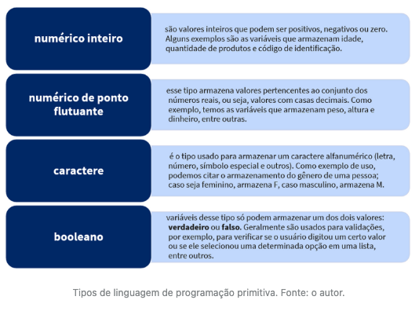
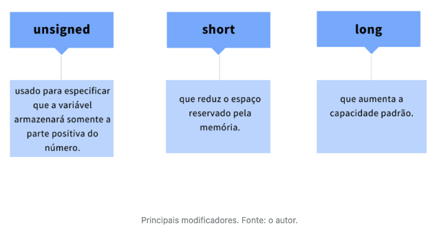
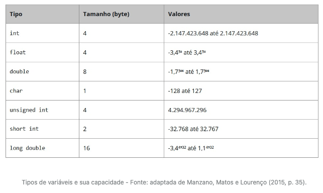

# Componentes e elementos de linguagem de programação

## Introdução da aula

- Nesta aula, você vai conhecer o conceito de variáveis e constantes, bem como seu uso na linguagem C.
- Até então, você já construiu um algoritmo capaz de receber como entradas a idade do cliente e a classificação indicativa do filme que ele pretende locar e, logo após, mostrar na tela um dos possíveis resultados: "Este filme não é indicado para sua faixa etária" ou "Este filme é indicado para sua faixa etária".
- Agora é hora de tirar essa ideia do papel e colocar para funcionar em um computador. Contudo, você ainda não dispõe de todos os conhecimentos necessários para implementar essa solução na linguagem C.
- Por isso, seu chefe lhe passou outra tarefa. Ele quer que seu programa seja capaz de ler a idade e o nome do cliente, bem como a classificação do filme que ele deseja locar. Posteriormente, seu programa deve imprimir todas essas informações na tela, conforme o padrão a seguir:

```
Cliente: José das Couves

Idade: 18 anos

Classificação do filme: 12 anos
```

- Seu chefe, que também é analista de sistemas, informou que você deve utilizar os conceitos de *struct*, variáveis e constantes para resolver esse problema.

---


## Variáveis

- Deitel e Deitel (2011, p. 43) nos trazem a seguinte definição: 

  > uma variável é uma posição na memória onde um valor pode ser armazenado para ser utilizado por um programa. 

- Soffner (2013, p. 33) incrementa dizendo que:

  > variáveis são endereços de memória de trabalho que guardam, temporariamente, um valor utilizado pelo programa.

- Todas as linguagens de programação têm **tipos primitivos** (ou básicos) e **compostos**. No grupo dos primitivos estão os seguintes tipos:



---


## Linguagem de programação C

- Para se usar uma variável na linguagem de programação C é preciso criá-la e, para isso, usa-se a seguinte sintaxe:

```
<tipo> <nome_da_variavel>
```

- Esse padrão é obrigatório e podemos usar os seguintes tipos primitivos: *`int`* (inteiro), *`float`* ou *`double`* (ponto flutuante) e *`char`* (caractere). O tipo booleano é representado pela palavra-chave *`bool`*, entretanto, para seu uso, é necessário incluir a biblioteca `<stdbool.h>`.
- Uma biblioteca é um conjunto de funções e tipos de dados que podem ser reutilizadas em nossos próprios programas.
- Veja no código a seguir a criação de algumas variáveis na linguagem C:

```C
#include <stdbool.h>
int main(){
  int idade;
  float salario = 1250.75;
  double porcentagem_desconto = 2.5;
  bool estaAprovado = false;
  char genero = 'M';
  return 0;
}
```

- É importante ressaltar que todo programa em C deve conter uma função específica, denominada "*main*". Ela representa o ponto inicial do seu programa, ou seja, o ponto a partir do qual o computador começará a executá-lo.
- É uma boa prática de programação sempre inicializar as variáveis com algum valor específico, evitando que recebam dados de processamentos anteriores e que estejam na memória (a esses dados nós damos o nome de lixo de memória). 
- Portanto, quando a variável for numérica, sempre vamos iniciar com zero; quando booleana, com falso; quando do tipo caractere, usaremos ' ' para atribuir vazio.

---


## Tipos de variáveis, sua capacidade e especificador de formato

- Como já mencionado, a quantidade de espaço que será alocada para uma variável depende do tipo de variável. Por exemplo, para uma variável int serão alocados 4 bytes na memória (MANZANO; MATOS; LOURENÇO, 2010). 
- Vejamos, 4 bytes são 32 bits. Cada bit só pode armazenar zero ou um. Portanto, nós temos a seguinte equação: valor máximo de uma variável inteira = 2³²=4.294.967.296. Porém, esse valor precisa ser dividido por dois, pois um inteiro pode armazenar números negativos e positivos. Logo, uma variável int poderá ter um valor entre -2.147.423.648 e 2.147.423.648.
- Para suprir parte da limitação dos valores que uma variável pode assumir pelo seu tipo, foram criados modificadores de tipos, os quais são palavras-chave usadas na declaração da variável que modifica sua capacidade-padrão. Os três principais modificadores são:




